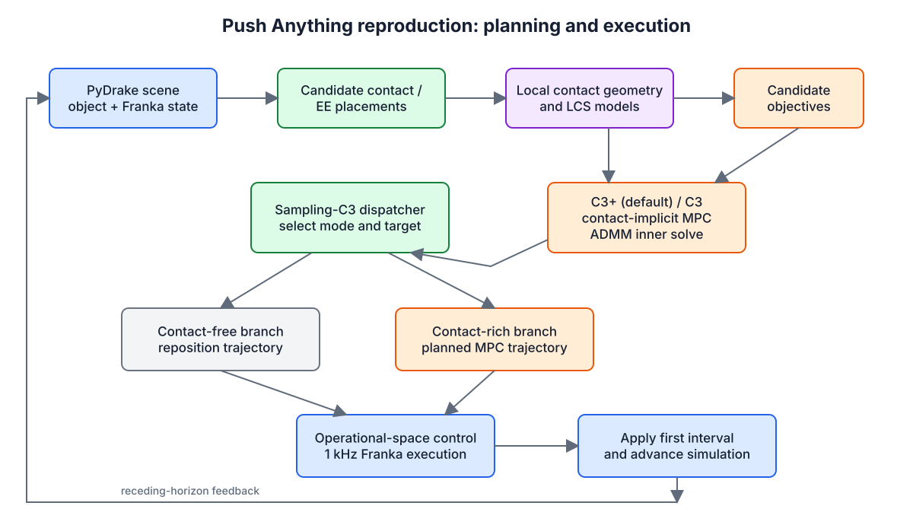
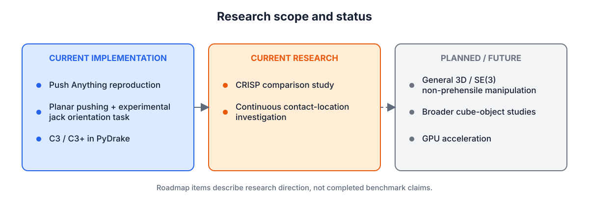
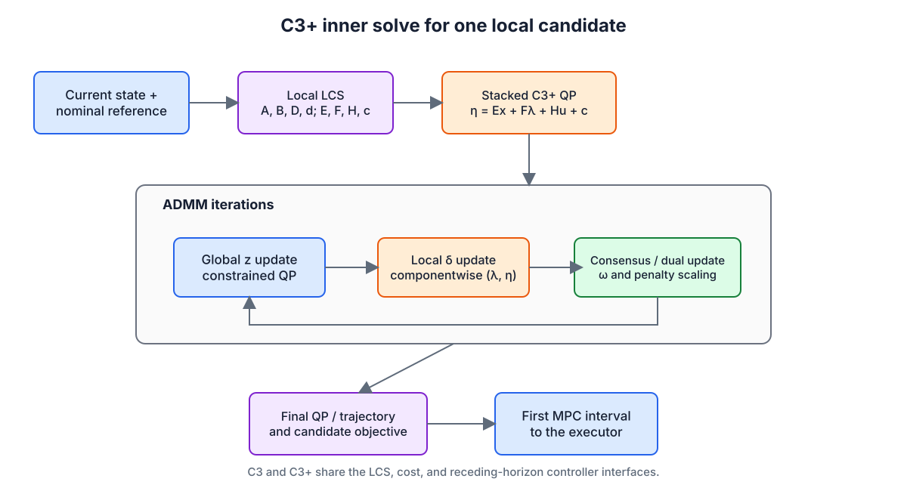
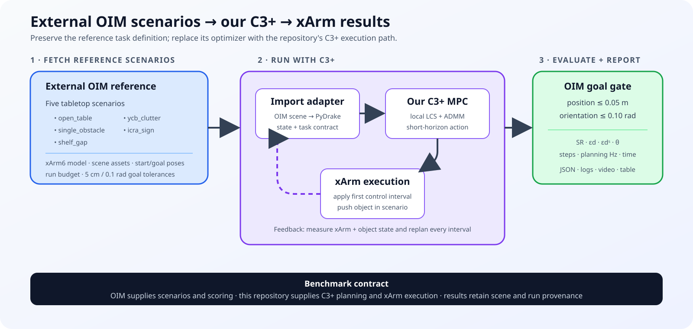

# Push Anything / C3+ Reproduction

A Python/PyDrake reproduction and research port of *Push Anything*: sampling-based
contact-implicit model predictive control for non-prehensile manipulation with a
Franka Panda. The repository combines local Linear Complementarity System (LCS)
models, C3/C3+ trajectory optimization, candidate contact placement, and
operational-space execution in simulation.

> **Status:** active research code. The planning and simulation stack runs
> end-to-end, but this is not a claim of full paper-level reproduction. Stored
> benchmarks include successful and censored trials, and the current test
> baseline is not fully green.



## Overview

The implementation follows the central decomposition used by *Push Anything*
and sampling-C3:

- **PyDrake plant:** a Franka Panda with a spherical pusher interacts with
  configurable rigid objects and a table.
- **Candidate sampling:** the outer controller generates possible end-effector
  placements around the current object geometry.
- **Local contact models:** each relevant state/candidate is linearized into an
  LCS with dynamics and complementarity matrices.
- **C3+ / C3 MPC:** the default C3+ path solves a finite-horizon contact-implicit
  problem; C3 remains available as a comparison/falsification path.
- **Mode selection:** candidate objectives and progress logic select either a
  contact-rich MPC trajectory or a contact-free reposition trajectory.
- **Execution:** an operational-space controller tracks the selected trajectory
  at a faster inner cadence and applies torques to the Franka simulation.

The current default planner uses the repository's reduced end-effector-space
formulation (`x ∈ R^19`, `u ∈ R^3` Cartesian force). The older full-plant
joint-torque formulation remains behind `--r7` for historical falsification
runs; it is not the default architecture.

## Current Research



The maintained implementation covers the Push Anything reproduction stack,
planar single-object pushing, C3/C3+, imported object geometries, and an
experimental jack task with full orientation goals. Current research directions
include a **CRISP comparison study** and investigation of **continuous contact
location**. There is no CRISP implementation in this repository.

General 3D/SE(3) non-prehensile manipulation, broader cube-object studies, and
GPU acceleration are roadmap items, not completed capabilities or benchmark
claims. Existing experimental task/configuration branches should not be read as
validated general-purpose 3D manipulation.

## Method



For each local candidate, `LCSFormulator` produces discrete dynamics

```text
x[t+1] = A x[t] + B u[t] + D λ[t] + d
```

and complementarity data based on the current contact geometry. C3+ introduces
the slack

```text
η[t] = E x[t] + F λ[t] + H u[t] + c,
0 ≤ λ[t] ⟂ η[t] ≥ 0.
```

`C3Solver` then alternates:

1. a global constrained-QP update;
2. the C3+ componentwise `(λ, η)` projection;
3. consensus/dual and penalty updates;
4. a final QP/trajectory extraction.

The candidate objective feeds the sampling-C3 dispatcher. As in receding-horizon
MPC, only the first execution interval is applied before the state and local
contact model are refreshed. See `control/admm_solver.py`,
`control/lcs_formulator.py`, `control/ci_mpc_c3plus.py`, and
`control/sampling_c3/` for the implementation.

## Object-Informed-Manipulation

The job is to fetch the five tabletop scenarios from the external OIM reference,
preserve their xArm model, scene assets, start/goal poses, and evaluation
protocol, then run each scenario with our C3+ controller and publish comparable
result artifacts. C3+ replans from the measured xArm and object state after each
executed control interval until the OIM goal gate passes or the run budget ends.



### Native C++ integration: `oim_c++_anything`

The native DAIRLab integration is isolated from the modified reference checkout
in a clean Git worktree:

- worktree: `reference_repos/oim_c++_anything`
- branch: `oim_c++_anything`
- baseline/design commit: `854a8afc`
- canonical task configuration:
  `examples/sampling_c3/oim_t/parameters/oim_t.yaml`
- maintained process diagram and validation gates:
  `examples/sampling_c3/oim_t/ARCHITECTURE.md`

The intended native process topology is:

```text
oim_t.yaml
 ├── xarm6_sim
 ├── xarm6_osc_controller
 └── xarm6_sampling_c3_controller
```

#### DAIRLab/Drake-to-xArm6 file correspondence

"Reference" below means the DAIRLab Sampling-C3 Franka/Push-T implementation
built on Drake, not an upstream Drake example. A row marked **reused** calls the
same implementation from the xArm6 targets; **adapted** identifies the xArm6
counterpart; **consolidated** records several reference configuration inputs in
the single canonical OIM YAML. This is an interface correspondence, not a claim
that different robot models or physics engines are numerically identical.

| DAIRLab/Drake reference | OIM xArm6 counterpart | Relationship |
|---|---|---|
| `examples/sampling_c3/BUILD.bazel` | `examples/sampling_c3/oim_t/BUILD.bazel` | **Adapted:** defines the three canonical `xarm6_*` processes and compatibility aliases without changing the Franka targets. |
| `examples/sampling_c3/franka_sim.cc` | `examples/sampling_c3/oim_t/xarm6_sim.cc` | **Adapted:** Drake plant/simulator and LCM state-command loop for the six-joint xArm, table, pusher capsule, and OIM T. |
| `examples/sampling_c3/franka_osc_controller.cc` | `examples/sampling_c3/oim_t/xarm6_osc_controller.cc` | **Adapted:** the same DAIRLab inverse-dynamics OSC architecture, with xArm6 frames, six-joint posture, passive spring, gravity, and source velocity-servo semantics. |
| `examples/sampling_c3/franka_sampling_c3_controller.cc` | `examples/sampling_c3/oim_t/xarm6_sampling_c3_controller.cc` | **Adapted:** live-state Sampling-C3+ orchestration, contact acquisition, receding execution, physical-response conditioning, and acceptance gates. |
| `systems/controllers/sampling_based_c3_controller.{cc,h}` | `examples/sampling_c3/oim_t/xarm6_full_sampling_c3plus.{cc,h}` | **Specialized wrapper:** preserves the C3/C3+ trajectory contract while adding the 19-state OIM T model, sampled contacts, xArm6 execution receipts, and safety predicates. |
| `systems/controllers/osc/operational_space_control.{cc,h}` and its tracking-data classes | Same `systems/controllers/osc/*` files | **Reused:** xArm6 links DAIRLab's OSC QP directly; there is no copied xArm-specific OSC solver. |
| `examples/sampling_c3/sampling_c3_utils.{cc,h}` and `@c3//` | Same utility and C3 library targets | **Reused:** trajectory encoding, LCS/C3 interfaces, and consensus/projection implementation remain shared. |
| `examples/sampling_c3/parameter_headers/{franka_sim_params,goal_params,sampling_c3_controller_params}.h` | `examples/sampling_c3/parameter_headers/oim_t_params.h` | **Consolidated:** typed Drake YAML schema for robot, simulation, object, task, controller, full Sampling-C3+, and LCM sections. |
| `examples/sampling_c3/push_t/parameters/{sim_params,goal_params,sampling_c3_controller_params}.yaml` | `examples/sampling_c3/oim_t/parameters/oim_t.yaml` | **Consolidated:** one authoritative OIM scenario file replaces the three task-level YAML inputs. |
| `push_t/parameters/{sampling_c3_options,sampling_c3plus_options,sampling_params,reposition_params}.yaml` | `oim_t.yaml` sections `full_sampling_c3plus` and `controller` | **Consolidated with provenance:** structural solver, sampling, and reposition values are explicit; unchanged values remain identified as Push-T/Anything carryovers. |
| `@drake_models//:franka_description` | `examples/sampling_c3/urdf/oim_xarm6_tabletop/xarm6/xarm6.xml` plus `xarm6_lcs_pusher.urdf` | **Model replacement:** six xArm joints and the physical pusher capsule replace the seven-joint Franka description. |
| `examples/sampling_c3/urdf/push_t.sdf` | `examples/sampling_c3/urdf/oim_xarm6_tabletop/t_block.sdf` | **Object replacement:** the OIM two-box T has its own measured geometry, mass, inertia, and collision representation. |
| Reference executable smoke coverage | `oim_t_config_check.cc` and `test/{xarm6_open_table_test,xarm6_full_sampling_c3plus_test}.cc` | **New validation:** checks the consolidated contract, six-joint plant, spatial Sampling-C3+ invariants, and open-table model loading. |

`oim_t.yaml` replaces the legacy task-level composition through
`sim_params.yaml`, `goal_params.yaml`, and
`sampling_c3_controller_params.yaml`. It owns the xArm model contract, OIM T
start and goal in the unwarped `oim_world` frame, simulation timing, success
tolerances, and LCM routing. Algorithm-specific C3+, sampling, repositioning,
progress, and OSC parameter files remain separate until their numerical
provenance has been validated for xArm.

Native configuration validation on 2026-08-29:

```text
command: bazel build --jobs=8 //examples/sampling_c3/oim_t:oim_t_config_check
build: PASS (cold Drake build; 12,016 actions)
command: bazel-bin/examples/sampling_c3/oim_t/oim_t_config_check
result: PASS (exit 0, 0.01 s, 49,972 KiB peak RSS)
config SHA-256: a3fdff33bcc8d0a5d46df8109e505601ef7570f3ab561593ad618ac6b5d2b574
```

The clean worktree now contains startup/model-contract implementations for
`xarm6_sim`, `xarm6_osc_controller`, and `xarm6_sampling_c3_controller`, plus the
narrowly vendored open-table xArm/OIM-T model. All three build and load the
six-joint plant. `xarm6_sim --duration=0.01` also advances successfully (0.57 s,
108,524 KiB peak RSS); the config checksum is
`7ab21d81805dc2aca97b8e986c7da75a5e63b6d4d8f4addf14e58f10f509e738`.

This is not yet an end-to-end manipulation result. The controller entry points
now wire OSC and the first sampled Sampling-C3+ step into LCM, but the pinned Drake MJCF parser
warns that it ignores velocity actuators, collision filter groups, and several
contact attributes. The native implementation recreates six torque actuators
explicitly, but those parser differences must be resolved before scientific
equivalence is claimed. The existing `franka_*` executables remain unchanged.
The Python port stays gated on continuous contact acquisition and a deterministic
object-pushing rollout. Full startup commands and measurements are recorded in
`examples/sampling_c3/oim_t/RUN_2026-08-29.md` in the C++ worktree.

The next Drake compatibility checkpoint restores the source model's joint-4
spring, five configured velocity and effort limits, and gravity compensation.
With gravity hold enabled, a deterministic one-second run measured zero joint
drift, end-effector point `[0.254967, -0.000911, 0.334228]` m, and T position
`[0.381020, 0.399991, 0.0297836]` m. Disabling gravity hold produces 0.194603
rad joint drift over the same interval, confirming that the compatibility path
is active rather than the test merely observing a naturally static model.

As of 2026-08-30, the native simulator and xArm controller also run as separate
LCM processes. A two-second state -> gravity controller -> torque -> simulator
test completed with 0.000769446 rad maximum joint drift. The T is now loaded as
a dedicated Drake SDF model and the table is registered natively, giving clean
robot and object state boundaries. This is the first closed transport loop; it
is not yet task-space OSC or a Sampling-C3+ manipulation run.

Task-space tracking and the first native C3+ solve now pass on the clean C++
branch. A +10 mm x tip request produced +7.604 mm displacement in five seconds
through the three-process LCM loop. The first five-knot, three-ADMM-iteration
C3+ solve completed in 1.03 ms using an exact-footprint one-contact
linearization.

The next live checkpoint consumes the observed xArm tip and native T pose,
transforms eight samples on the exact two-box T boundary into world coordinates,
solves one C3+ candidate for each, selects `stem_bottom`, and publishes a capped
first Cartesian step through OSC. The five-second stack exits cleanly for the
simulator and planner; OSC is intentionally timed out after simulation. The T
remains stationary because the initial tool is still about 0.126 m away and
this checkpoint initially emitted only one planning step. A ten-step run now
refreshes live state and resolves all eight candidates at 500 ms intervals, but
it preserves a negative result: `stem_bottom` is repeatedly selected, its
linearized gap grows from 0.315961 to 0.316252 m, and the T does not move. The
next required gate is an explicit free-space approach and tangential-alignment
phase before activating the unilateral contact model; weights and tolerances
were not retuned to hide the failure.

That approach phase is now implemented and was exercised for 2,000 live
execution steps. It selects `crossbar_top_left`, the face whose reaction matches
the negative-y object goal, and keeps C3+ disabled until a 3 mm 3D alignment
gate is reached. Approach error decreased from 0.534144 to 0.518165 m, but the
gate was not reached and the T remained stationary. The current limiting issue
is task-space execution: despite positive-x incremental targets, coupled
five-DOF Jacobian-transpose tracking let observed tip x drift slightly negative.
This is an approach-controller result, not a successful manipulation result.

The native controller now wraps its upstream task torque in the source xArm
velocity-servo law and preserves MuJoCo's force-clamp ordering. Repeating the
same 2,000-step run changed final approach error by only 0.031 mm, confirming
that actuator semantics were not the source of the tracking defect. The
that checkpoint isolated the remaining mismatch upstream: native C++ was still
using a provisional Jacobian-transpose task controller rather than DAIRLab's
inverse-dynamics OSC QP.

The native path now instantiates that DAIRLab inverse-dynamics OSC QP directly
on the five-joint xArm and feeds its total torque through the verified source
velocity-servo bridge. A state-aware source safely holds the measured tip before
the first planner message; a two-second no-planner test measured 0.000656939 rad
maximum joint drift. In the 2,000-step approach, error decreased by 29.692 mm
versus 15.979 mm with the provisional controller, but the 3 mm contact gate was
not reached and x still drifted slightly negative over the full rollout. This
validates the OSC integration, not Cartesian-axis equivalence or object pushing.

#### Native `open_table` implementation gates — 2026-08-30

Work continued from clean-branch commit
`f5c53479c6b7bb9e0a5d58d29af2c6c2b10f8bce` in the
`reference_repos/oim_c++_anything` worktree. These measurements use an
intentionally dirty research worktree containing nine modified OIM/xArm
source, BUILD, header, and configuration files; they have not been pushed as a
successful scenario result. The tested `oim_t.yaml` SHA-256 is
`a6a61454f82cdc577747e0e345075e5633edf8fb6d256356edae9aa2c5004e92`.

The trajectory receiver was corrected to accept simulation timestamp zero, and
independent Cartesian smoke gates established that +10 mm x, y, and z requests
reach OSC. Observed displacements were +6.819 mm, +4.756 mm, and +10.340 mm.
A dual-OSC phase path was added: roll/pitch-conditioned DAIRLab OSC handles
planar acquisition and translation-only OSC handles descent. Making descent
selection monotonic fixed the isolated 50 mm descent regression: the tip moved
50.61 mm downward while remaining within 1.84 mm in the horizontal plane. The
simulator now also reports pusher-capsule endpoints and final controlled-joint
positions.

The live planner selects the goal-facing `crossbar_top_left` sample, latches
one exact-T boundary sample for the acquisition episode, and uses explicit
`align-y -> align-x -> descend -> engage` phases. Descent starts from a
YAML-configured 20 mm collision-free standoff and uses latched 10 mm Cartesian
waypoints; C3+ remains behind the existing 3 mm 3D activation gate. These are
structural acquisition changes. C3+ iterations, ADMM settings, gains, task
success tolerances, object dynamics, and random behavior were not retuned.

The five-joint descent is now conditioned by Drake differential IK. It uses the
live tip Jacobian, canonical position and velocity limits, and the posture
latched at descent entry to generate a weak joint-space target for the
translation-only OSC. The isolated 50 mm gate moved 50.44 mm downward with
2.36 mm planar error and no T motion. An 85,000-update rollout then completed
the approximately 300 mm free-space descent, kept the T stationary to within
settling noise, and entered lateral engagement at object height.

Contact handoff is now monotonic as well. In the 100,000-update acceptance run,
Sampling-C3+ remained in `contact` from step 86,500 through 99,999. The T moved
from the settled `[0.380998, 0.399094]` m position to
`[0.389676, 0.383036]` m: 16.058 mm toward negative y, 8.678 mm positive-x
drift, and a 16.010 mm reduction in planar goal error. This passes the
no-contact descent, engagement, and sustained reduced-model push gates. It is
not complete `open_table` success because yaw is not yet planned and the
unchanged simultaneous translation/orientation tolerances were not reached.

Rotational T contact planning and lateral-drift rejection are now implemented
locally. The reduced contact state includes T yaw/yaw rate, uses the exact SDF
planar inertia and sampled boundary moment arm, and preserves the configured
+pi direction at the wrapped-angle branch cut. Candidate selection applies a
hard predicted-x corridor before ranking x/y/yaw goal cost. During the final
92,000-update, 210-second gate, the selected `crossbar_top_left` contact
rejected 6 of 8 finite candidates, reduced yaw error by 0.029237 rad, and kept
physical lateral drift to 0.835 mm under the configured 5 mm limit. A repeated
run measured 0.029303 rad yaw and 0.727 mm drift. Contact commands now remain at
the object's planar height; this fixes an observed vertical-feedback path that
previously let the pusher climb over the T.

These results pass initial physical rotational progress and lateral rejection,
but `open_table_success` remains `FAIL`: final planar goal error was 0.796897 m,
so the unchanged simultaneous translation/orientation tolerances were not met.

Successor-face continuation and collision-free repositioning are now
implemented locally. The controller keeps C3 on one physical face, scores
other faces at hypothetical contact poses, and switches only after minimum
dwell plus measured-progress or relative-cost hysteresis. A switch executes
the DAIRLab-anything piecewise-linear order `lift -> traverse -> descend ->
engage -> contact`. Clearance handoff and physical contact are separate gates:
the former uses the configured 5 mm clearance plus 3 mm activation band, while
the latter still requires an exact face gap below 3 mm.

The reduced-model quarter-turn witness autonomously selected
`crossbar_right`. A diagnostic forced only the timing and face of the otherwise
identical physical transition so it could be exercised without first waiting
for approximately 90 degrees of rotation. The switch occurred at update
86,011; repositioning moved the T by 0.605 mm and 0.000162 rad while traverse
targets remained between 76.960 and 78.970 mm high. Clearance handoff passed at
update 130,732 with 8.000 mm normal gap and 2.782 mm tangential error, followed
by physical successor contact at update 130,830 with 2.955 mm gap. The
diagnostic flags default off.

An unforced 92,000-update regression made no premature face switch, reduced yaw
error by 0.028505 rad, and limited lateral drift to 0.505 mm. It still reports
`open_table_success=FAIL`: the canonical rollout has not accumulated enough
rotation to reach the autonomous quarter-turn switch, and terminal translation
remains outside the unchanged task tolerance. The next gate is sustained
autonomous multi-face execution through that switch. The `oim_t.yaml` SHA-256
at that checkpoint was
`84136976a32f979ee96a54668da01576eb7f292e018e902c757e57f9f16936a0`;
commands, dependencies, negative runs, and raw-output locations are recorded in
the C++ run log and `docs/port-todo.md`.

Sustained autonomous multi-face execution now passes with all diagnostic
overrides disabled. The controller drains LCM subscriptions to the newest
state before each solve, preventing the 500 Hz xArm state stream from building
an unbounded stale-state queue. Exact finite-face tracking prevents the planar
half-space model from escaping a T edge. Successor filtering uses the wrist
side of the measured stick axis, rejects top-surface shaft approaches, and
revalidates task progress and clearance at the elevated traverse pose. A
measured lateral guard releases rotation-dominant contacts at 2 mm;
translation-dominant contacts may use the remaining configured corridor while
awaiting acceptance, with the original 5 mm tolerance still the hard limit.

The diagnostics-off 530-second run autonomously executed
`crossbar_top_left -> crossbar_right -> crossbar_top_left`, passed two
collision-free reposition receipts, and produced three independent Drake
capsule--T contact episodes. The successor contacts were on the T side at
z=35.181 mm and z=34.729 mm, not the 59.585 mm top surface. At update 185,910
the sustained gate passed with 1,000 continuation steps, 2.009 mm negative-y
progress, 0.05123 rad yaw progress, and 2.505 mm lateral error. The final T pose
was `[0.378507, 0.396077, 0.0297973]` m at yaw `0.0509243` rad; lateral
rejection passed at 2.493 mm. `open_table_success` remains `FAIL` because the
terminal translation error is 0.796081 m and yaw is still far from pi. The next
gate is repeated accepted face cycles to the unchanged terminal tolerances.
Current `oim_t.yaml` SHA-256:
`dca603c45fc78c3187d79850769a424f58098bda3ff3d7718b9437f83a4a63b6`.
Raw logs: `/tmp/oim-autonomous-multiface-gate-pass.EuokfT`.

Repeated autonomous acceptance is now stateful rather than a one-shot receipt.
Each accepted cycle resets its measured T-pose and reposition baseline, and the
2,000-step watchdog checks both unchanged minimum progress components. A face
is reselected when either negative-y or yaw progress is deficient; a low-shaft
candidate is used only to initiate vertical release and is revalidated before
lateral traverse. The diagnostics-off 620-second gate completed two independent
cycles over five Drake contact episodes and four collision-free repositions.
Cycle 1 passed with 2.004 mm negative-y progress, 0.01959 rad yaw progress, and
1.234 mm lateral error; cycle 2 passed with 2.003 mm, 0.02146 rad, and 2.610 mm,
respectively. The final T pose was `[0.378403, 0.394435, 0.0297836]` m at yaw
`0.0404373` rad. The unchanged terminal test remains `FAIL` at 0.794440 m
translation error and 3.10116 rad orientation error. The YAML was not changed
and retains SHA-256
`dca603c45fc78c3187d79850769a424f58098bda3ff3d7718b9437f83a4a63b6`.
Raw logs: `/tmp/oim-repeated-cycle-gate.x45A6Y`.

The OSC memory gate now passes. The DAIRLab `FastOsqpSolver` rebuilt its OSQP
workspace every control update, allocated fresh CSC value/index arrays, marked
those arrays caller-owned, and then freed only the small matrix wrapper. The
arrays are now owned by the OSQP matrix and released on every rebuild; final
workspace, matrix, and settings cleanup is explicit. Direct decoding of the
two-point task target also avoids four redundant `LcmTrajectory` map builds
without changing the trajectory data or interpolation. In the diagnostics-off
380-second regression, OSC RSS changed from 91,480 KiB to 91,640 KiB overall
and only 4 KiB over the final 120 seconds. The same run produced two physical
Drake contacts and passed two collision-free repositions. A 1,000-rebuild
solver regression, the existing solver test, all four OIM targets, config
validation, deterministic witnesses, and `git diff --check` pass. Fixed raw
logs: `/tmp/oim-osc-memory-gate-fixed.NEjmVi`; preserved negative diagnostic:
`/tmp/oim-osc-memory-gate.0YPa0w`.

The productive-cycling gate was attempted and exposed a missing physical
successor contact. Moving
two-knot FOH execution now matches the DAIRLab trajectory contract during C3
contact, successor engagement, and repositioning. In the diagnostics-off
300-second run, the first face reached its guard after 1,129 contact steps with
0.03137 rad yaw progress (roughly ten times the earlier 2,000-step result), and
both geometric repositions passed collision-free checks. Drake recorded only
the initial physical contact episode, however, so neither geometric successor
counts as a productive cycle. The final T pose was
`[0.379019, 0.397200, 0.0297973]` m at yaw `0.0312457` rad.

The full terminal evaluation against the unchanged 0.05 m translation and
0.10 rad orientation tolerances remains `FAIL`: errors were 0.797202 m and
3.11035 rad. A reduced-model lateral-recovery grace was rejected after measured
error grew from 2.044 mm to 5.008 mm. Five-DOF shaft-conditioning prototypes
(differential IK, nonlinear IK, and axis-only OSC) also failed to preserve the
elevated tip and were reverted; their negative logs were preserved. Canonical
output is `/tmp/oim-productive-foh-probe.UjmshB`, the recovery negative is
`/tmp/oim-productive-lateral-gate.IBopsx`, and the unchanged YAML SHA-256 is
`dca603c45fc78c3187d79850769a424f58098bda3ff3d7718b9437f83a4a63b6`.

That next gate now **passes**. Repositioning uses measured-state-seeded Drake IK
and a primary joint-only OSC. Every velocity-limited joint increment checks nine
configurations of the entire 168.3 mm capsule centerline against the
radius-expanded two-box T and table, and checks the tip separately. The
diagnostics-off 400-second run selected the measured-x-corrective
`crossbar_right` face, passed the collision receipt with all four predicates
true (minimum capsule/table margin 28.858 mm), reached a 2.977 mm geometric gap,
and Drake then recorded physical contact episode 2 at 386.306 s with 0.674861 N.
Raw logs: `/tmp/oim-second-physical-corrective-contact-dwell.wqOgjA`.

This is a gate success, not terminal `open_table` success. Final translation and
orientation errors were 0.795091 m and 3.03079 rad against the unchanged 0.05 m
and 0.10 rad tolerances, and final lateral drift was 8.305 mm. The next gate is
productive corrective-face dwell that recovers measured lateral error before
the following reposition, then another unchanged-tolerance terminal rollout.
The updated YAML SHA-256 is
`dd7c8e2e9e7ffa8d75d5b2f7109d57e6a96ddafb432bcf14d2b7214da6cc55cd`.

The productive corrective-face dwell gate now **passes**. On an isolated,
diagnostics-off three-process run, measured tangential recovery on the already
physical `crossbar_top_left` contact reduced x error from 2.00357 mm to a best
0.523481 mm (1.48009 mm measured recovery), held the unchanged 1,000-step
dwell, and released `crossbar_right` with 0.526700 mm final lateral error.
Drake independently recorded contact from 168.712 to 181.406 s. Raw logs:
`/tmp/oim-productive-corrective-inline-isolated.No1IiU`.

The 240-second gate run is not terminal success: translation/orientation error
remained 0.795631 m / 3.11161 rad against the unchanged 0.05 m / 0.10 rad
tolerances. The next gate is a full autonomous terminal rollout with repeated
productive recovery. The YAML checksum is unchanged.

The terminal-rollout gate remains in progress. Repeated recovery no
longer pays the 1,000-step proof dwell on every event: the first measured
recovery still completes that unchanged dwell, while later independent
1 mm/corridor receipts resume the same productive face immediately. An
isolated 260-second probe completed 18 recoveries, advanced 50.522 mm in y and
0.653414 rad in yaw during one contact block, and then selected a new face.
Raw output: `/tmp/oim-repeat-recovery-fast.Xr5d4H`.

Two defects exposed by the first full rollout were corrected without changing
YAML. First, recovery grace could suppress the configured 2,000-step progress
watchdog indefinitely; a deficient window now preserves an `ABORT` receipt and
releases a task-progress successor. This path was physically verified at step
226,367 after x error improved from 4.815 to 3.827 mm but did not enter the
2 mm corridor. Second, translation-only release allowed the inclined capsule
to touch the T top, and nominal descent clearance produced a micrometer-scale
capsule graze. Bounded measured-posture IK plus one radius of descent standoff
removed both in one 470-second replay, but a later terminal attempt reproduced
a brief top touch at 221.588--221.858 s. That run was rejected. Repositioning
now begins with an explicit 20 mm outward retreat along the current physical
face normal before vertical lift, then retains the extra radius through
traverse/descent until lateral engagement. Two independent 260-second replays
had no post-release contact while reaching 76.7/76.6 mm tip height. Accepted
release replays: `/tmp/oim-outward-retreat-replay.jusSxw` and
`/tmp/oim-outward-retreat-repeat.QeL3IP`; preserved negatives:
`/tmp/oim-terminal-autonomous.wa5woU`,
`/tmp/oim-terminal-autonomous-fixed.MflGUR`, and
`/tmp/oim-descend-collision-replay.1DEXir`. The insufficient single standoff
replay is `/tmp/oim-descend-standoff-replay.lobh5W`, and the rejected terminal
attempt is `/tmp/oim-full-terminal-standoff.YeyJaV`. Terminal success is not
claimed until a new full rollout meets both unchanged tolerances. The YAML SHA-256
remains `dd7c8e2e9e7ffa8d75d5b2f7109d57e6a96ddafb432bcf14d2b7214da6cc55cd`.

The 2026-08-31 eight-hour terminal plan has now completed its controller and
arbitration audit, but not the terminal-success gate. Elevated reposition
authority was restored by wiring the existing reposition posture gains and
adding model-derived damping feedforward inside the unchanged xArm
velocity/effort clamps. A diagnostics-only pose proved the measured shaft can
cross the existing 1 mm orient-to-traverse threshold and complete
collision-free repositioning. Autonomous execution then exposed and fixed two
transaction errors: the chosen successor face is now latched through traverse,
and ordinary guard-based switching cannot bypass the configured physical
successor dwell.

With diagnostics disabled, selection, collision receipt, geometric handoff,
and physical Drake contact were all proved one-to-one on `stem_bottom`. A
later sustained-recovery run accepted a full multi-face cycle with 70.559 mm
negative-y progress, 0.921741 rad yaw progress, and 4.647 mm lateral error.
Recovery now remains active outside the 5 mm bound while corrective, but the
unchanged 2,000-step task-progress watchdog aborts a measured failure instead
of allowing indefinite divergence. Controller, OSC, and simulator RSS remained
bounded at approximately 92, 92, and 130 MiB, respectively.

The final 700-second canonical rollout is a preserved negative. It ended at T
pose `[0.599209, 0.206400, 0.0297973]` m and yaw `1.31871` rad, with
0.644466 m translation error, 1.82289 rad orientation error, and 0.218209 m
lateral drift. `open_table_success=FAIL`. Drake also recorded contact points at
the T top (`z≈59.55..59.60 mm`), proving that reposition-only clearance was
insufficient. Raw terminal negative:
`/tmp/oim-autonomous-recovery-watchdog.Ie81or`; accepted-cycle evidence:
`/tmp/oim-autonomous-sustained-recovery.WO0Gyp`. The YAML checksum remains
`dd7c8e2e9e7ffa8d75d5b2f7109d57e6a96ddafb432bcf14d2b7214da6cc55cd`.

The contact-phase safety gate is now implemented but not yet physically
accepted. Every contact command sweeps the measured inclined capsule at nine
samples against the exact radius-expanded two-box T and table, excluding only
the intended distal activation band. Unsafe commands hold the live tip and
enter the existing collision-free reposition transaction. Corrective recovery
now also rejects measured wrong-polarity response after the unchanged dwell and
derived 1 mm response threshold. In the diagnostics-off 300-second replay,
ten unsafe commands produced ten rejection receipts and ten passing
repositions; Drake recorded zero top contacts, but also zero intended force
contacts. The final T was `[0.380998, 0.397536, 0.0297973]` m at yaw
`-2.34e-06` rad, so `open_table_success=FAIL`. Attempts to impose a safe
five-DOF contact axis either displaced the tip or stalled and were reverted.
The next gate is a capsule-feasible five-DOF contact-posture/candidate policy
that proves intended side force contact before exercising the measured
wrong-polarity rejection and rerunning the unchanged terminal tolerances.
Accepted safety evidence: `/tmp/oim-contact-phase-clearance.YBWT6E`;
preserved rejected experiments:
`/tmp/oim-contact-engagement-clearance.9pFo7U` and
`/tmp/oim-contact-diffik-clearance.uL60JG`. Configuration and checksum are
unchanged.

The capsule-feasible contact-posture gate now **passes for the first physical
face**. OIM's local +Z stick axis is commanded vertical-down through descent,
engagement, and contact using the existing differential-IK path. The clearance
predicate now distinguishes the selected face's intentional cylindrical side
contact from an inward-leaning shaft intersection; other T-box and table
intersections remain forbidden. A deterministic loaded-contact witness accepts
the vertical posture and rejects an inward-inclined posture at the identical
tip point. In the diagnostics-off 230-second Drake replay, eight physical
side-contact episodes produced 13,392 force samples, 19.2452 N peak force, and
contact points at z=34.41--34.82 mm, safely below the T top at 59.6 mm. Ten
measured lateral-recovery receipts passed, yaw advanced 0.404557 rad, lateral
drift remained 2.03546 mm, and only one later unsafe capsule command was
rejected before a clean successor reposition. `open_table_success=FAIL`: the
run ended at translation/orientation errors 0.769181 m / 2.73703 rad, and the
`crossbar_right` successor stalled 8.975 mm short during vertical-conditioned
engagement. The next gate is a reachability-conditioned successor engagement
that preserves the proved capsule safety and obtains a second physical face,
followed by a deliberately exercised measured wrong-polarity rejection and
the unchanged terminal rollout. Raw evidence:
`/tmp/oim-vertical-contact-gate.XJQsNG`. The YAML checksum remains
`dd7c8e2e9e7ffa8d75d5b2f7109d57e6a96ddafb432bcf14d2b7214da6cc55cd`.

Item 14 is implemented, but only its first three physical acceptance
components pass. Successor engagement now uses velocity-bounded,
measured-state-seeded vertical-contact IK plus a swept selected-face capsule
receipt. It reached `crossbar_right` at step 92,714, and Drake independently
reported the second-face force episode at 223.098 s. Corrective ownership now
follows every successor engaged outside the measured lateral guard. A
diagnostics-off run emitted `measured_wrong_polarity_response=REJECT` after the
unchanged 1,000-step dwell when error grew from 2.07508 to 4.19107 mm, beyond
the existing 1 mm threshold. Loaded corrective motion preserves normal
compression and spends its command tangentially; one physical recovery reduced
error by 1.23255 mm in 46 steps. No YAML or solver setting changed.

Full terminal acceptance still **fails**. Later successor acquisition exposed
upper-perimeter contacts near z=59.58--59.59 mm and a traverse posture without
a collision-free commanded interpolation. Successor arbitration now excludes
the empirically unsafe crossbar-top perimeter after the initial proven
acquisition. Failed traverse execution attempts a fixed-tip capsule-safe
posture recovery; if unavailable, it holds measured state and replans instead
of aborting. This last fail-safe builds and passes deterministic checks but has
not completed a physical terminal replay. Accepted second-face evidence:
`/tmp/oim-successor-reachability.UMLJdz`; accepted response evidence:
`/tmp/oim-full-gate-terminal.QgC4uD`; preserved terminal negatives:
`/tmp/oim-loaded-recovery.FCt0LZ`,
`/tmp/oim-terminal-centered-recovery.iatOFi`, and
`/tmp/oim-side-stem-successors.MJvnVy`.

The Drake T is geometrically and inertially matched to OIM: 89.0 x 19.8 mm
crossbar at y=+9.9 mm, 19.8 x 79.4 mm stem at y=-39.7 mm, 59.6 mm thickness,
0.100 kg total mass, composite center of mass y=-14.9 mm, and sliding friction
0.30. See `examples/sampling_c3/oim_t/OIM_T_PROVENANCE.md` and
`oim_t_top_view.svg` in the C++ worktree.

### Single-Object Pushing

The latest-model seed-0 campaign completed all 28 consecutive tight goals for
17 of 25 objects. Gallon Milk and Eraser retain their recorded failures; they
were not replaced with easier seeds. The remaining six failures were reproduced
with the current controller and inspected from their complete session logs.

| Object | Goals reached | First failed goal | Result | Diagnosed cause |
|---|---:|---:|:---:|---|
| Y Shape Video | 4/28 | 5 | Fail | Near-success timeout: 0.0022 m position error and 0.1078 rad orientation error; just outside the reference 0.10 rad gate. |
| E Shape Video | 4/28 | 5 | Fail | No-contact recovery loop after approaching the goal; final errors 0.0263 m and 0.0861 rad. |
| Wood Block | 24/28 | 25 | Fail | Planner/reposition stall; repeated low-productivity C3 contacts, ending at 0.0840 m and 1.5641 rad. |
| Tape | 2/28 | 3 | Fail | Near-success timeout: 0.0154 m and 0.1155 rad, followed by repeated no-contact retries. |
| Milk Bottle | 5/28 | 6 | Fail | No-contact recovery loop; the object drifted to 0.1808 m position error while C3 produced no effective correction. |
| Egg Carton | 3/28 | 4 | Fail | Inner workspace-limit abort at EE radius 0.2787 m (minimum 0.280 m). |
| Eraser | 0/28 | 1 | Fail | Persistent topple at approximately 1.59 rad; the planar controller has no roll/pitch recovery action. |
| Gallon Milk | 0/28 | 1 | Fail | Outer workspace-limit abort at EE radius 0.7543 m (maximum 0.750 m). |

The success test remains reference-conformant: position error must be below
0.02 m and quaternion geodesic orientation error below 0.10 rad at the same
instant. The near-success rows must therefore remain failures rather than being
hidden by a relaxed metric.

The actionable controller defect is the no-contact recovery loop. After an
unproductive C3 segment, the dispatcher can reposition and then select an
equivalent ineffective contact again until the per-goal timeout. The intended
fix is to invalidate repeatedly unsuccessful contact samples, require predicted
contact closure and nontrivial commanded force before accepting a reposition,
and force a fresh global sample set after a bounded number of retries. Workspace
targets and their tracked trajectories should additionally be projected into a
5–10 mm tightened workspace. Topple recovery for Eraser requires a separate
non-planar controller and is not addressed by the C3 retry fix.

### xArm6 `open_table` audit — 2026-08-31

The native C++ worktree now uses a true six-joint xArm6 throughout the model,
configuration, simulator state/command path, OSC, differential IK,
collision-aware posture IK, and whole-pusher-capsule checks. The focused xArm6
and Full Sampling-C3+ tests pass. Three execution defects found by the full
Drake rollout were fixed without changing numerical parameters: release/lift
IK no longer mixes in premature contact reorientation, posture trajectories
hold their final knot instead of extrapolating velocity indefinitely, and lift
overshoot can be collision-checked back into the existing completion band.

The final 2,000-update evidence run completed acquisition, three physical
contact episodes, measured lateral rejection and recovery, strict progress
resampling, and a productive 1,000-step corrective-face dwell. It achieved
8.3007 mm goal-directed translation and 0.14446 rad yaw improvement with
2.28601 mm lateral drift. This proves the xArm6 process wiring and one complete
receding control cycle; it does **not** prove terminal task success. The
independent simulator result remains `open_table_success=FAIL` at 0.790798 m
translation error and 2.98282 rad orientation error versus the unchanged
0.05 m / 0.10 rad tolerances.

The remaining gate is an outer measured-state loop that repeats Sampling-C3+
resampling, collision-free repositioning, contact, and recovery until the
global terminal acceptance passes or the execution budget is exhausted. Its
candidate arbitration must also include the live xArm6 contact-IK receipt and
fall through when a reduced-rollout candidate is unreachable. Failure paths
now publish a measured-state hold before raising. The controller reports global
acceptance explicitly and cannot equate one productive local cycle with
terminal `open_table` success. See
[`XARM6_OPEN_TABLE_CHECKLIST_2026-08-31.md`](reference_repos/oim_c++_anything/examples/sampling_c3/oim_t/XARM6_OPEN_TABLE_CHECKLIST_2026-08-31.md)
for the itemized audit, commands, provenance, and raw-output location.

#### xArm6 controller-item completion — 2026-08-31

The two previously listed controller mechanisms are implemented. Progress and
recovery candidates are replayed from the current measured six-joint posture
through release/lift, vertical traverse, descent, final contact IK, and swept
capsule clearance. Static failures enter the rejected buffer. A candidate that
fails only under physical OSC tracking is quarantined for that measured pose;
the controller releases, resamples, and falls through instead of aborting on
the same sample again.

The productive phase is now an outer measured-state receding loop. A measured
run proved cycle 1, safe inter-cycle release, and cycle-2 resampling. Later
lateral rejection releases the active face before recovery replay, admits the
existing contact-only recovery fallback only after live xArm6 IK validation,
and stops a response that crosses the goal corridor instead of continuing with
the old force polarity. All failure exits publish a measured-state hold.

Terminal `open_table` remains incomplete. The current blocker is narrower:
after a later-cycle lateral rejection, the latest measured posture had no
reachable corrective final-contact IK among 72 candidates. This is successor
recovery reachability, not missing xArm6 wiring or a missing receding loop. No
solver, dynamics, contact, gain, horizon, seed, tolerance, or success parameter
was changed. Detailed receipts and output paths are in the xArm6 checklist.

#### xArm6 later-cycle recovery gates — 2026-08-31

The later-cycle reachability blocker is resolved. Candidate replay now uses
the same configured bounded Cartesian substeps as physical execution instead
of asking Drake IK to jump directly to a distant final-contact waypoint. The
receipt also distinguishes an IK solve failure from whole-capsule/table
clearance rejection. In
`results/xarm6_bounded_live_replay_5000_j3s88r`, the controller selected a
live-reachable second-cycle stem contact, rejected its wrong-polarity measured
response after eight dwell steps, released it, reached a corrective right
face, and restored lateral drift to 2.82219 mm.

A safely corrected but nonproductive contact no longer terminates receding
control. It is reported separately as a recovery-only continuation and is
replanned from measured object and six-joint state. The unchanged-parameter
run `results/xarm6_recovery_continuation_5000_5YFAmK` proved four productive
cycles, three recovery-only continuations, 18 physical contact episodes, and
repeated live-IK-conditioned lateral recovery before the external wall-clock
timeout. It did not reach terminal success; the independent simulator ended at
0.810405 m translation error and 2.48259 rad orientation error.

Measured lateral-response failures now enter the existing pose-local sample
quarantine. `results/xarm6_response_quarantine_3000_b4UbB1` proves the
quarantine receipt and safe measured-state terminal hold. Progress sampling
now also contains four explicit deterministic perimeter/mesh retry families,
expanding the later-pose buffer from 136 to 200 candidates without changing
the configured seeds. In
`results/xarm6_progress_replenishment_2000_lAHPvQ`, two consecutive replans
retained executable candidates, proving that replenishment gate. The next gate
was physical fall-through for a recovery candidate whose static replay passes
but whose final contact IK fails under measured OSC tracking.

That fall-through is now implemented as a ranked measured-state loop. Each
failed physical acquisition records its phase and sample, quarantines that
sample, treats its face as the next release geometry, and reruns live IK and
whole-capsule clearance from the newly measured six-joint posture. In
`results/xarm6_recovery_physical_fallthrough_repeat_2000_Jt4OVF`, the static
replay accepted `mesh_crossbar_left_seeded_9`, physical final-contact IK
rejected it, and the controller selected `crossbar_left_seeded_4` on retry.
The successor contact recovered lateral drift to 1.65903 mm and completed the
first receding cycle. The same run remains a terminal failure: a later recovery
response worsened lateral drift to 47.0298 mm and exhausted the execution
budget. The next gate is therefore measured recovery-response worsening
rejection and early release/replan, not acquisition fall-through.

No solver, dynamics, gain, horizon, seed, tolerance, contact, or success
parameter was changed. The OIM YAML SHA-256 remained
`bc1b710fe705cc1b05850f9426b000c987c40c0767d69cf020fc94a13898d68e`.

#### xArm6 full-cycle safety and continuation gates — 2026-08-31

The native C++ Full Sampling-C3+ loop now conditions Drake's measured spatial
object velocity at the planar LCS boundary, admits a contact cycle only when
the unchanged 1,000-step dwell fits in the remaining budget, and returns
classified failure receipts instead of aborting. Candidate acquisition and
physical execution share measured-pose contact reconstruction, ranked
fall-through, failed-face release, whole-capsule lift/traverse/lower checks,
bounded 2 mm contact engagement, wrong-polarity/contact-loss rejection, and a
quasistatic retry only when the measured-velocity batch has no executable
candidate. Raw six-axis velocity remains in every receipt.

Long-rollout evidence at
`results/xarm6_bounded_contact_engagement_physical_5000_QHGyZU` proved six
productive cycles and a full 1,000-step dwell. The later
`results/xarm6_velocity_fallback_physical_20000_CeISun` run proved 14
productive cycles before a retry lift was conservatively rejected. A
vertical-only lift completion fix then reached 11 cycles in
`results/xarm6_vertical_completion_physical_20000_CroKyA`; it exposed an
unstable far-reach posture route rather than terminal task success.

Release/lift/anchor steps now use bounded local differential IK with the
existing velocity, joint-limit, and centering parameters. Each predicted
joint step must reduce Cartesian error and pass the interpolated entire-pusher
capsule receipt. All post-contact repositions lift above the complete T,
retreat to the neutral workspace, verticalize there, and only then traverse.
`results/xarm6_mandatory_neutral_anchor_physical_5000_tGkCM7` physically
proved three progress and three recovery neutral-anchor routes. Its budget expired
safely during an above-table traverse at tip z=0.241177 m; no fall-through was
observed.

The global `open_table` gate remains **FAIL** under the unchanged 0.05 m
translation and 0.10 rad orientation tolerances. The best continuation runs
still make slow/oscillatory y/yaw progress, so the next gate is measured
terminal-error descent arbitration across complete contact cycles. No solver
tolerance, ADMM value, horizon, dynamics/contact parameter, gain, seed, task
tolerance, or success criterion was changed in these gates. Current source
commit is `f5c53479c6b7bb9e0a5d58d29af2c6c2b10f8bce` with the cumulative dirty
OIM/xArm worktree; the canonical OIM YAML SHA-256 is
`d11cd65efbcf6ac7c814a0b690cc76f9135d27a9f607f6f10dc7d9b26051b990`.

#### xArm6 cycle-level terminal descent gate — 2026-08-31

The next gate is implemented. Predicted and measured contact responses now use
one shared Pareto receipt: planar translation and wrapped-yaw error must both
be nonregressive, and at least one must satisfy its existing minimum-progress
threshold. Measured regression cannot be accepted as y-only progress; it stops
the dwell, quarantines the candidate after real contact evidence, releases the
face, and replans. Pre-contact failures are kept separate from response
rejection.

The collision-aware reposition OSC also tracks the Cartesian waypoint paired
with its differential-IK posture, using the existing gains. This removed the
neutral-anchor posture equilibrium seen in the first 5,000-update diagnostic.
The physical rollout at
`results/xarm6_terminal_descent_physical_20000_0Ov79a` passed all approach
phases, recorded 24 Drake contact episodes, accepted seven globally
nonregressive cycles, rejected four orientation-regressive cycles, and passed
a full 1,000-step sustained dwell with measured progress of +0.00142678 m and
+0.0332332 rad. The simulator still reports **FAIL** at 0.746148 m translation
and 2.93704 rad orientation error, so this is a gate completion rather than an
`open_table` success claim.

Four focused native tests pass. No solver tolerance, ADMM value, horizon,
dynamics/contact parameter, gain, seed, task tolerance, or success criterion
changed. The next gate is measured-response-conditioned candidate ranking to
reduce repeated model/plant yaw and lateral-response mismatch.

#### xArm6 measured-response-conditioned ranking gate — 2026-08-31

The controller now retains measured contact outcomes and the C3+ terminal pose
that predicted each one. New candidates are corrected using accumulated local
translation/yaw prediction residuals and ordered in three stable classes:
measured-compatible, unseen, then measured-incompatible. Original C3+ cost
order remains unchanged within each class, and incompatible contacts remain
available only as deterministic fall-through. The existing task tolerances
define pose/contact neighborhoods; no learned weight or threshold was added.

The physical receipt at
`results/xarm6_measured_response_ranking_physical_8000_ZLD4wx` captured a
`-0.721512 rad` yaw prediction residual, then classified 42 candidates as
incompatible after two observations and selected an unseen stem contact. That
contact passed a complete 1,000-step dwell. The subsequent partition contained
one compatible, 18 unseen, and 39 incompatible candidates, proving that
measured evidence changes later ordering. The aligned follow-up is retained at
`results/xarm6_measured_response_ranking_aligned_6500_sR3r2Y`.

`open_table` remains **FAIL**. The next gate is now executable/live-IK candidate
availability after a large measured yaw transition: one rollout exhausted 58
dynamic candidates at live verticalization IK, while the aligned rollout's
next batch had zero dynamically executable candidates. Solver settings,
controller gains, sampling seeds, task tolerances, and success criteria remain
unchanged.

#### xArm6 post-yaw candidate-availability gate — 2026-08-31

The controller now has a contact-feasible replenishment view for the case where
both measured-velocity and quasistatic workspace-filtered batches are empty.
Only dynamically accepted, input-bounded candidates enter that view, and every
one must still pass measured xArm live IK and whole-capsule execution. Shared
neutral-anchor verticalization can also retry from the configured home seed;
the velocity-clipped step must reduce axis error and retain the existing tip and
collision receipts.

The physical rollout at
`results/xarm6_post_yaw_candidate_availability_physical_8000_bfs6i3` crossed a
`-1.11431 rad` yaw model residual and completed five subsequent replans with 20
progress live-IK passes. Candidate sets of 56, 191, 194, and 200 remained
available, three productive cycles passed, and the final lateral error was
3.59921 mm. Execution stopped through the unchanged dwell-budget admission at
update 7,728—not candidate exhaustion. The simulator still reports
`open_table_success=FAIL` at 0.731024 m and 2.93876 rad error.

All controller/solver parameters and the canonical YAML remain unchanged. The
next gate is the full terminal rollout against the existing 0.05 m translation
and 0.10 rad orientation tolerances.

#### xArm6 mathematics, current status, and next gate — 2026-08-31

This section is the current mathematical contract for the renamed native
`xarm6_*` path. Earlier sections are chronological gate records and are not
retroactively rewritten when a later experiment exposes a new failure.

##### Contact model and Sampling-C3+

The optimizer does not use the six arm joints as its state. It uses a spatial
reduced model of one Cartesian pusher and one floating T object:

$$
x_k = [p^P_{W,k},\ q_{WO,k},\ p^O_{W,k},\
       \dot p^P_{W,k},\ \omega^O_{W,k},\ \dot p^O_{W,k}]
       \in \mathbb{R}^{19},
\qquad u_k \in \mathbb{R}^{3}.
$$

Here $p^P_W$ is the pusher position, $q_{WO}$ is the object's unit
quaternion, and $p^O_W$ is the object position. The input is the pusher's
three-axis actuation. The table, two-box T, and pusher contacts are represented
by a linear complementarity system at each knot:

$$
x_{k+1}=A_kx_k+B_ku_k+D_k\lambda_k+d_k,
\qquad
0\leq\lambda_k\ \perp\
E_kx_k+F_ku_k+H_k\lambda_k+c_k\geq0.
$$

The complementarity condition means that a contact gap and its compressive
contact force cannot both be positive. C3+ solves sampled local contact
problems and reconciles their trajectories through its consensus/projection
iterations. The unchanged configuration uses horizon $N=5$, step
$\Delta t=0.05$ s, and three ADMM iterations. Its quadratic rollout score is
of the form

$$
J=\sum_{k=0}^{N-1}
\left[(x_k-x_k^*)^TQ(x_k-x_k^*)+u_k^TRu_k\right]
+(x_N-x_N^*)^TQ(x_N-x_N^*),
$$

with the checked-in YAML supplying the existing diagonal scales. Contact
sampling does not change this objective. For an object-frame sample
$(r_s,n_s,h_s)$, the initial pusher point is

$$
p^P_{W,xy}=p^O_{W,xy}+R(\psi)r_s+R(\psi)n_s
\left(r_P-\frac{\epsilon_a}{2}\right),
\qquad p^P_{W,z}=h_O+h_s,
$$

where $r_P$ is the measured pusher radius and $\epsilon_a=3$ mm is the
existing activation tolerance. Exact-T, seeded perimeter, mesh-normal, and
local stem refinements are solved independently; only dynamically accepted
candidates proceed to measured xArm6 IK and whole-capsule validation.

##### Six-joint OSC and actuator mapping

The selected Cartesian plan is executed by the six-joint Drake plant. The
DAIRLab inverse-dynamics OSC uses the measured end-effector Jacobian and a task
acceleration of the standard form

$$
a^* = K_p(p_d-p)-K_dJ(q)\dot q,
\qquad
M(q)\dot v+h(q,v)=B\tau+J_c(q)^T\lambda_c.
$$

The OSC QP returns a total torque $\tau_{osc}$. The source xArm velocity-servo
semantics are then reconstructed exactly around that torque. With gravity
compensation $\tau_g$, servo gain $k_v$, velocity bound $\bar v$, and effort
bound $\bar\tau$,

$$
\begin{aligned}
\tau_s^* &= \tau_{osc}-\tau_g,\\
\dot q_{cmd} &= \operatorname{clip}
  \left(\dot q+\tau_s^*/k_v,-\bar v,\bar v\right),\\
\tau_s &= \operatorname{clip}
  \left(k_v(\dot q_{cmd}-\dot q),-\bar\tau,\bar\tau\right),\\
\tau_{cmd} &= \tau_s+\tau_g.
\end{aligned}
$$

Gravity is deliberately added outside the actuator clamp, matching the source
MuJoCo ordering. Joint-4 stiffness remains a passive Drake force. This is why
the controller accepts a three-dimensional Cartesian C3+ input while the
physical arm still commands all six actuator torques.

##### Measured safety and progress gates

Let $g=(p^g_{xy},\psi_g)$ be the unchanged task goal. Translation and wrapped
yaw errors are

$$
e_t(x)=\|p_{xy}-p^g_{xy}\|_2,
\qquad e_\psi(x)=|\operatorname{wrap}(\psi_g-\psi)|.
$$

A physical cycle from $x_a$ to $x_b$ is accepted only when both errors are
nonregressive and at least one meets its existing minimum-progress threshold:

$$
\Delta_t=e_t(x_a)-e_t(x_b)\geq0,
\quad
\Delta_\psi=e_\psi(x_a)-e_\psi(x_b)\geq0,
\quad
(\Delta_t\geq\delta_t\ \lor\ \Delta_\psi\geq\delta_\psi).
$$

The hard lateral corridor is $|p_x-p_x^g|\leq5$ mm. New contact planning starts
inside the derived reserve

$$
e_x^{reserve}=5\text{ mm}-\epsilon_a=2\text{ mm},
$$

and uses only central side contacts satisfying $|h_s|\leq r_P$. If a full
C3+ prediction eventually leaves the corridor, execution retains the longest
contiguous safe prefix

$$
j^*=\max\{j:\ |\hat p^O_{x,i}-p_x^g|\leq5\text{ mm}
\text{ for every }i\leq j\},
$$

then re-solves from measured state. The original full solver receipt remains
unchanged for traceability.

For repeated contacts, the controller also stores the measured-minus-predicted
displacement residual. For $M$ matching pose/contact observations, it corrects
a new terminal estimate by

$$
\hat x_N^{corr}=\hat x_N+
\frac{1}{M}\sum_{i=1}^{M}
\left[(x_{N,i}^{meas}-x_{0,i})-(\hat x_{N,i}-x_{0,i})\right],
$$

with yaw differences wrapped. Candidates are ordered as measured-compatible,
unseen, then measured-incompatible; every executed candidate still requires
live six-joint IK, swept pusher-capsule clearance, and the unchanged lateral
checks.

##### What currently works

| Component | Current evidence |
|---|---|
| xArm6 model/process identity | Canonical `xarm6_sim`, `xarm6_osc_controller`, and `xarm6_sampling_c3_controller` build; a 0.01 s six-joint Drake smoke run passes. |
| OSC/actuator connection | Six measured joint states produce six bounded torques through inverse-dynamics OSC, the velocity-servo bridge, passive stiffness, and gravity compensation. |
| Full spatial Sampling-C3+ | The 19-state, 3-input, five-knot solver, exact/seeded/mesh sampling, dynamic rollout, and deterministic reduction pass focused native tests. |
| Physical contact safety | Settling, central-side contact, live IK, whole-capsule/table clearance, wrong-polarity rejection, release, and lateral recovery have physical receipts. |
| Receding execution | `results/xarm6_corridor_prefix_gate_8000_9BC4hk` passed four progress replans and three productive cycles after the previous zero-intersection failure. |
| Candidate availability | `results/xarm6_postfilter_replenishment_8000_kj2Oc9` exercised downstream contact-feasible replenishment twice, recovering 200 candidates and admitting seven then four plans. |

##### What does not yet work

`open_table` is still **FAIL**. In the latest 8,000-update rollout the final
object pose was $(0.380192,0.331412,-0.525025)$, leaving 0.731412 m translation
error and 2.61656 rad orientation error against the unchanged 0.05 m and
0.10 rad tolerances. Model/plant response disagreement also remains: measured
conditioning, quarantine, and recovery contain bad contacts, but they do not
make the five-knot reduced prediction physically exact. Drake still warns that
some source MJCF attributes are unsupported, so simulator equivalence to the
source xArm model is not claimed. The Python port has not yet reproduced this
latest native C++ closed-loop behavior.

The immediate failure is execution-budget accounting. The current admission
test is only

$$
B-u>N_{dwell},
$$

where $B$ is the rollout budget, $u$ is updates already used, and
$N_{dwell}=1000$. At update 6,709, the remaining 1,291 updates passed that
test, but release, neutral-anchor acquisition, contact, and corrective recovery
consumed the reserve; recovery reached update 8,000 before completing the
cycle.

##### Next gate: measured-overhead-aware cycle admission

The next implementation must reserve the complete candidate-specific physical
cycle, not only its dwell:

$$
B-u > \hat N_{acquire}(q,p^P,x^O,s)
      +N_{dwell}+\hat N_{release/recover}.
$$

$\hat N_{acquire}$ must come from the existing live-IK waypoint receipt, and
$\hat N_{release/recover}$ must come from measured phase-update receipts; this
must not introduce a new tuned YAML margin. The gate passes only when an
insufficient late cycle is deferred before leaving the safe hold, while a run
with sufficient budget still completes acquisition, the unchanged 1,000-step
dwell, release/recovery, and a measured terminal-descent receipt. After that,
the following gate is the full terminal rollout against the unchanged
0.05 m/0.10 rad simultaneous tolerances.

## Single-Object Pushing

The corrected protocol uses one uninterrupted manipulation session per object:
the robot, object, controller state, and random-goal stream carry over across all
28 goals. Each goal has its own 600-second simulated-time limit. A session passes
only if it reaches all 28 goals consecutively; failed sessions are not replaced
with another seed.

The latest-model campaign reran 23 objects on August 28, 2026 and retained the
requested prior outcomes for Eraser and Gallon Milk. The combined result is
**17 passing sessions out of 25 objects**. Full current results and provenance
are in [`FIG8_CONSECUTIVE_28_LATEST_SESSIONS.csv`](FIG8_CONSECUTIVE_28_LATEST_SESSIONS.csv).

| Object | Consecutive goals | Outcome | Failure cause |
|---|---:|:---:|---|
| Letter I | 28/28 | Pass | — |
| Letter C | 28/28 | Pass | — |
| Letter R | 28/28 | Pass | — |
| Letter A | 28/28 | Pass | — |
| Letter Y | 4/28 | Fail | Near-success timeout: 0.0022 m position error and 0.1078 rad orientation error |
| Letter G | 28/28 | Pass | — |
| Letter B | 28/28 | Pass | — |
| Letter 3 | 28/28 | Pass | — |
| Letter H | 28/28 | Pass | — |
| Letter E | 4/28 | Fail | No-contact recovery loop; final errors 0.0263 m and 0.0861 rad |
| Letter S | 28/28 | Pass | — |
| Expo Box | 28/28 | Pass | — |
| Lotion | 28/28 | Pass | — |
| Wood Block | 24/28 | Fail | Planner/reposition stall; final errors 0.0840 m and 1.5641 rad |
| Tape | 2/28 | Fail | Near-success timeout: 0.0154 m and 0.1155 rad, followed by no-contact retries |
| Eraser | 0/28 | Fail | Persistent topple (retained) |
| Milk Bottle | 5/28 | Fail | No-contact recovery loop; final position error 0.1808 m |
| Clamp | 28/28 | Pass | — |
| Chicken Broth | 28/28 | Pass | — |
| Egg Carton | 3/28 | Fail | Inner workspace limit: EE radius 0.2787 m (minimum 0.280 m) |
| Book | 28/28 | Pass | — |
| Baby Toy | 28/28 | Pass | — |
| Gallon Milk | 0/28 | Fail | Outer workspace limit: EE radius 0.7543 m (maximum 0.750 m; retained) |
| Xbox | 28/28 | Pass | — |
| Push T | 28/28 | Pass | — |

The success gate remains reference-conformant: position error must be below
0.02 m and quaternion geodesic orientation error below 0.10 rad simultaneously.
The primary actionable defect is a no-contact recovery loop: after an
unproductive C3 segment, the dispatcher can reposition and select an equivalent
ineffective contact repeatedly until timeout. Candidate failures should be
invalidated, accepted reposition samples should predict contact closure and a
nontrivial force, and repeated retries should force a fresh global sample set.
Workspace targets and their tracked trajectories also need a 5–10 mm safety
margin. Eraser requires separate non-planar topple recovery.

## Object-Informed-Manipulation

### Native C++ integration: `oim_c++_anything`

The native DAIRLab integration is isolated from the modified reference checkout
in a clean Git worktree:

- worktree: `reference_repos/oim_c++_anything`
- branch: `oim_c++_anything`
- baseline/design commit: `854a8afc`
- canonical task configuration:
  `examples/sampling_c3/oim_t/parameters/oim_t.yaml`
- maintained process diagram and validation gates:
  `examples/sampling_c3/oim_t/ARCHITECTURE.md`

The intended native process topology is:

```text
oim_t.yaml
 ├── xarm6_sim
 ├── xarm6_osc_controller
 └── xarm6_sampling_c3_controller
```

`oim_t.yaml` replaces the legacy task-level composition through
`sim_params.yaml`, `goal_params.yaml`, and
`sampling_c3_controller_params.yaml`. It owns the xArm model contract, OIM T
start and goal in the unwarped `oim_world` frame, simulation timing, success
tolerances, and LCM routing. Algorithm-specific C3+, sampling, repositioning,
progress, and OSC parameter files remain separate until their numerical
provenance has been validated for xArm.

Native configuration validation on 2026-08-29:

```text
command: bazel build --jobs=8 //examples/sampling_c3/oim_t:oim_t_config_check
build: PASS (cold Drake build; 12,016 actions)
command: bazel-bin/examples/sampling_c3/oim_t/oim_t_config_check
result: PASS (exit 0, 0.01 s, 49,972 KiB peak RSS)
config SHA-256: a3fdff33bcc8d0a5d46df8109e505601ef7570f3ab561593ad618ac6b5d2b574
```

The clean worktree now contains startup/model-contract implementations for
`xarm6_sim`, `xarm6_osc_controller`, and `xarm6_sampling_c3_controller`, plus the
narrowly vendored open-table xArm/OIM-T model. All three build and load the
six-joint plant. `xarm6_sim --duration=0.01` also advances successfully (0.57 s,
108,524 KiB peak RSS); the config checksum is
`7ab21d81805dc2aca97b8e986c7da75a5e63b6d4d8f4addf14e58f10f509e738`.

This is not yet an end-to-end manipulation result. The controller entry points
now wire OSC and the first sampled Sampling-C3+ step into LCM, but the pinned Drake MJCF parser
warns that it ignores velocity actuators, collision filter groups, and several
contact attributes. The native implementation recreates six torque actuators
explicitly, but those parser differences must be resolved before scientific
equivalence is claimed. The existing `franka_*` executables remain unchanged.
The Python port stays gated on continuous contact acquisition and a deterministic
object-pushing rollout. Full startup commands and measurements are recorded in
`examples/sampling_c3/oim_t/RUN_2026-08-29.md` in the C++ worktree.

The next Drake compatibility checkpoint restores the source model's joint-4
spring, five configured velocity and effort limits, and gravity compensation.
With gravity hold enabled, a deterministic one-second run measured zero joint
drift, end-effector point `[0.254967, -0.000911, 0.334228]` m, and T position
`[0.381020, 0.399991, 0.0297836]` m. Disabling gravity hold produces 0.194603
rad joint drift over the same interval, confirming that the compatibility path
is active rather than the test merely observing a naturally static model.

As of 2026-08-30, the native simulator and xArm controller also run as separate
LCM processes. A two-second state -> gravity controller -> torque -> simulator
test completed with 0.000769446 rad maximum joint drift. The T is now loaded as
a dedicated Drake SDF model and the table is registered natively, giving clean
robot and object state boundaries. This is the first closed transport loop; it
is not yet task-space OSC or a Sampling-C3+ manipulation run.

Task-space tracking and the first native C3+ solve now pass on the clean C++
branch. A +10 mm x tip request produced +7.604 mm displacement in five seconds
through the three-process LCM loop. The first five-knot, three-ADMM-iteration
C3+ solve completed in 1.03 ms using an exact-footprint one-contact
linearization.

The next live checkpoint consumes the observed xArm tip and native T pose,
transforms eight samples on the exact two-box T boundary into world coordinates,
solves one C3+ candidate for each, selects `stem_bottom`, and publishes a capped
first Cartesian step through OSC. The five-second stack exits cleanly for the
simulator and planner; OSC is intentionally timed out after simulation. The T
remains stationary because the initial tool is still about 0.126 m away and
this checkpoint initially emitted only one planning step. A ten-step run now
refreshes live state and resolves all eight candidates at 500 ms intervals, but
it preserves a negative result: `stem_bottom` is repeatedly selected, its
linearized gap grows from 0.315961 to 0.316252 m, and the T does not move. The
next required gate is an explicit free-space approach and tangential-alignment
phase before activating the unilateral contact model; weights and tolerances
were not retuned to hide the failure.

That approach phase is now implemented and was exercised for 2,000 live
execution steps. It selects `crossbar_top_left`, the face whose reaction matches
the negative-y object goal, and keeps C3+ disabled until a 3 mm 3D alignment
gate is reached. Approach error decreased from 0.534144 to 0.518165 m, but the
gate was not reached and the T remained stationary. The current limiting issue
is task-space execution: despite positive-x incremental targets, coupled
five-DOF Jacobian-transpose tracking let observed tip x drift slightly negative.
This is an approach-controller result, not a successful manipulation result.

The native controller now wraps its upstream task torque in the source xArm
velocity-servo law and preserves MuJoCo's force-clamp ordering. Repeating the
same 2,000-step run changed final approach error by only 0.031 mm, confirming
that actuator semantics were not the source of the tracking defect. The
that checkpoint isolated the remaining mismatch upstream: native C++ was still
using a provisional Jacobian-transpose task controller rather than DAIRLab's
inverse-dynamics OSC QP.

The native path now instantiates that DAIRLab inverse-dynamics OSC QP directly
on the five-joint xArm and feeds its total torque through the verified source
velocity-servo bridge. A state-aware source safely holds the measured tip before
the first planner message; a two-second no-planner test measured 0.000656939 rad
maximum joint drift. In the 2,000-step approach, error decreased by 29.692 mm
versus 15.979 mm with the provisional controller, but the 3 mm contact gate was
not reached and x still drifted slightly negative over the full rollout. This
validates the OSC integration, not Cartesian-axis equivalence or object pushing.

#### Native `open_table` implementation gates — 2026-08-30

Work continued from clean-branch commit
`f5c53479c6b7bb9e0a5d58d29af2c6c2b10f8bce` in the
`reference_repos/oim_c++_anything` worktree. These measurements use an
intentionally dirty research worktree containing nine modified OIM/xArm
source, BUILD, header, and configuration files; they have not been pushed as a
successful scenario result. The tested `oim_t.yaml` SHA-256 is
`a6a61454f82cdc577747e0e345075e5633edf8fb6d256356edae9aa2c5004e92`.

The trajectory receiver was corrected to accept simulation timestamp zero, and
independent Cartesian smoke gates established that +10 mm x, y, and z requests
reach OSC. Observed displacements were +6.819 mm, +4.756 mm, and +10.340 mm.
A dual-OSC phase path was added: roll/pitch-conditioned DAIRLab OSC handles
planar acquisition and translation-only OSC handles descent. Making descent
selection monotonic fixed the isolated 50 mm descent regression: the tip moved
50.61 mm downward while remaining within 1.84 mm in the horizontal plane. The
simulator now also reports pusher-capsule endpoints and final controlled-joint
positions.

The live planner selects the goal-facing `crossbar_top_left` sample, latches
one exact-T boundary sample for the acquisition episode, and uses explicit
`align-y -> align-x -> descend -> engage` phases. Descent starts from a
YAML-configured 20 mm collision-free standoff and uses latched 10 mm Cartesian
waypoints; C3+ remains behind the existing 3 mm 3D activation gate. These are
structural acquisition changes. C3+ iterations, ADMM settings, gains, task
success tolerances, object dynamics, and random behavior were not retuned.

The five-joint descent is now conditioned by Drake differential IK. It uses the
live tip Jacobian, canonical position and velocity limits, and the posture
latched at descent entry to generate a weak joint-space target for the
translation-only OSC. The isolated 50 mm gate moved 50.44 mm downward with
2.36 mm planar error and no T motion. An 85,000-update rollout then completed
the approximately 300 mm free-space descent, kept the T stationary to within
settling noise, and entered lateral engagement at object height.

Contact handoff is now monotonic as well. In the 100,000-update acceptance run,
Sampling-C3+ remained in `contact` from step 86,500 through 99,999. The T moved
from the settled `[0.380998, 0.399094]` m position to
`[0.389676, 0.383036]` m: 16.058 mm toward negative y, 8.678 mm positive-x
drift, and a 16.010 mm reduction in planar goal error. This passes the
no-contact descent, engagement, and sustained reduced-model push gates. It is
not complete `open_table` success because yaw is not yet planned and the
unchanged simultaneous translation/orientation tolerances were not reached.

Rotational T contact planning and lateral-drift rejection are now implemented
locally. The reduced contact state includes T yaw/yaw rate, uses the exact SDF
planar inertia and sampled boundary moment arm, and preserves the configured
+pi direction at the wrapped-angle branch cut. Candidate selection applies a
hard predicted-x corridor before ranking x/y/yaw goal cost. During the final
92,000-update, 210-second gate, the selected `crossbar_top_left` contact
rejected 6 of 8 finite candidates, reduced yaw error by 0.029237 rad, and kept
physical lateral drift to 0.835 mm under the configured 5 mm limit. A repeated
run measured 0.029303 rad yaw and 0.727 mm drift. Contact commands now remain at
the object's planar height; this fixes an observed vertical-feedback path that
previously let the pusher climb over the T.

These results pass initial physical rotational progress and lateral rejection,
but `open_table_success` remains `FAIL`: final planar goal error was 0.796897 m,
so the unchanged simultaneous translation/orientation tolerances were not met.

Successor-face continuation and collision-free repositioning are now
implemented locally. The controller keeps C3 on one physical face, scores
other faces at hypothetical contact poses, and switches only after minimum
dwell plus measured-progress or relative-cost hysteresis. A switch executes
the DAIRLab-anything piecewise-linear order `lift -> traverse -> descend ->
engage -> contact`. Clearance handoff and physical contact are separate gates:
the former uses the configured 5 mm clearance plus 3 mm activation band, while
the latter still requires an exact face gap below 3 mm.

The reduced-model quarter-turn witness autonomously selected
`crossbar_right`. A diagnostic forced only the timing and face of the otherwise
identical physical transition so it could be exercised without first waiting
for approximately 90 degrees of rotation. The switch occurred at update
86,011; repositioning moved the T by 0.605 mm and 0.000162 rad while traverse
targets remained between 76.960 and 78.970 mm high. Clearance handoff passed at
update 130,732 with 8.000 mm normal gap and 2.782 mm tangential error, followed
by physical successor contact at update 130,830 with 2.955 mm gap. The
diagnostic flags default off.

An unforced 92,000-update regression made no premature face switch, reduced yaw
error by 0.028505 rad, and limited lateral drift to 0.505 mm. It still reports
`open_table_success=FAIL`: the canonical rollout has not accumulated enough
rotation to reach the autonomous quarter-turn switch, and terminal translation
remains outside the unchanged task tolerance. The next gate is sustained
autonomous multi-face execution through that switch. The `oim_t.yaml` SHA-256
at that checkpoint was
`84136976a32f979ee96a54668da01576eb7f292e018e902c757e57f9f16936a0`;
commands, dependencies, negative runs, and raw-output locations are recorded in
the C++ run log and `docs/port-todo.md`.

Sustained autonomous multi-face execution now passes with all diagnostic
overrides disabled. The controller drains LCM subscriptions to the newest
state before each solve, preventing the 500 Hz xArm state stream from building
an unbounded stale-state queue. Exact finite-face tracking prevents the planar
half-space model from escaping a T edge. Successor filtering uses the wrist
side of the measured stick axis, rejects top-surface shaft approaches, and
revalidates task progress and clearance at the elevated traverse pose. A
measured lateral guard releases rotation-dominant contacts at 2 mm;
translation-dominant contacts may use the remaining configured corridor while
awaiting acceptance, with the original 5 mm tolerance still the hard limit.

The diagnostics-off 530-second run autonomously executed
`crossbar_top_left -> crossbar_right -> crossbar_top_left`, passed two
collision-free reposition receipts, and produced three independent Drake
capsule--T contact episodes. The successor contacts were on the T side at
z=35.181 mm and z=34.729 mm, not the 59.585 mm top surface. At update 185,910
the sustained gate passed with 1,000 continuation steps, 2.009 mm negative-y
progress, 0.05123 rad yaw progress, and 2.505 mm lateral error. The final T pose
was `[0.378507, 0.396077, 0.0297973]` m at yaw `0.0509243` rad; lateral
rejection passed at 2.493 mm. `open_table_success` remains `FAIL` because the
terminal translation error is 0.796081 m and yaw is still far from pi. The next
gate is repeated accepted face cycles to the unchanged terminal tolerances.
Current `oim_t.yaml` SHA-256:
`dca603c45fc78c3187d79850769a424f58098bda3ff3d7718b9437f83a4a63b6`.
Raw logs: `/tmp/oim-autonomous-multiface-gate-pass.EuokfT`.

Repeated autonomous acceptance is now stateful rather than a one-shot receipt.
Each accepted cycle resets its measured T-pose and reposition baseline, and the
2,000-step watchdog checks both unchanged minimum progress components. A face
is reselected when either negative-y or yaw progress is deficient; a low-shaft
candidate is used only to initiate vertical release and is revalidated before
lateral traverse. The diagnostics-off 620-second gate completed two independent
cycles over five Drake contact episodes and four collision-free repositions.
Cycle 1 passed with 2.004 mm negative-y progress, 0.01959 rad yaw progress, and
1.234 mm lateral error; cycle 2 passed with 2.003 mm, 0.02146 rad, and 2.610 mm,
respectively. The final T pose was `[0.378403, 0.394435, 0.0297836]` m at yaw
`0.0404373` rad. The unchanged terminal test remains `FAIL` at 0.794440 m
translation error and 3.10116 rad orientation error. The YAML was not changed
and retains SHA-256
`dca603c45fc78c3187d79850769a424f58098bda3ff3d7718b9437f83a4a63b6`.
Raw logs: `/tmp/oim-repeated-cycle-gate.x45A6Y`.

The OSC memory gate now passes. The DAIRLab `FastOsqpSolver` rebuilt its OSQP
workspace every control update, allocated fresh CSC value/index arrays, marked
those arrays caller-owned, and then freed only the small matrix wrapper. The
arrays are now owned by the OSQP matrix and released on every rebuild; final
workspace, matrix, and settings cleanup is explicit. Direct decoding of the
two-point task target also avoids four redundant `LcmTrajectory` map builds
without changing the trajectory data or interpolation. In the diagnostics-off
380-second regression, OSC RSS changed from 91,480 KiB to 91,640 KiB overall
and only 4 KiB over the final 120 seconds. The same run produced two physical
Drake contacts and passed two collision-free repositions. A 1,000-rebuild
solver regression, the existing solver test, all four OIM targets, config
validation, deterministic witnesses, and `git diff --check` pass. Fixed raw
logs: `/tmp/oim-osc-memory-gate-fixed.NEjmVi`; preserved negative diagnostic:
`/tmp/oim-osc-memory-gate.0YPa0w`.

The productive-cycling gate was attempted and exposed a missing physical
successor contact. Moving
two-knot FOH execution now matches the DAIRLab trajectory contract during C3
contact, successor engagement, and repositioning. In the diagnostics-off
300-second run, the first face reached its guard after 1,129 contact steps with
0.03137 rad yaw progress (roughly ten times the earlier 2,000-step result), and
both geometric repositions passed collision-free checks. Drake recorded only
the initial physical contact episode, however, so neither geometric successor
counts as a productive cycle. The final T pose was
`[0.379019, 0.397200, 0.0297973]` m at yaw `0.0312457` rad.

The full terminal evaluation against the unchanged 0.05 m translation and
0.10 rad orientation tolerances remains `FAIL`: errors were 0.797202 m and
3.11035 rad. A reduced-model lateral-recovery grace was rejected after measured
error grew from 2.044 mm to 5.008 mm. Five-DOF shaft-conditioning prototypes
(differential IK, nonlinear IK, and axis-only OSC) also failed to preserve the
elevated tip and were reverted; their negative logs were preserved. Canonical
output is `/tmp/oim-productive-foh-probe.UjmshB`, the recovery negative is
`/tmp/oim-productive-lateral-gate.IBopsx`, and the unchanged YAML SHA-256 is
`dca603c45fc78c3187d79850769a424f58098bda3ff3d7718b9437f83a4a63b6`.

That next gate now **passes**. Repositioning uses measured-state-seeded Drake IK
and a primary joint-only OSC. Every velocity-limited joint increment checks nine
configurations of the entire 168.3 mm capsule centerline against the
radius-expanded two-box T and table, and checks the tip separately. The
diagnostics-off 400-second run selected the measured-x-corrective
`crossbar_right` face, passed the collision receipt with all four predicates
true (minimum capsule/table margin 28.858 mm), reached a 2.977 mm geometric gap,
and Drake then recorded physical contact episode 2 at 386.306 s with 0.674861 N.
Raw logs: `/tmp/oim-second-physical-corrective-contact-dwell.wqOgjA`.

This is a gate success, not terminal `open_table` success. Final translation and
orientation errors were 0.795091 m and 3.03079 rad against the unchanged 0.05 m
and 0.10 rad tolerances, and final lateral drift was 8.305 mm. The next gate is
productive corrective-face dwell that recovers measured lateral error before
the following reposition, then another unchanged-tolerance terminal rollout.
The updated YAML SHA-256 is
`dd7c8e2e9e7ffa8d75d5b2f7109d57e6a96ddafb432bcf14d2b7214da6cc55cd`.

The productive corrective-face dwell gate now **passes**. On an isolated,
diagnostics-off three-process run, measured tangential recovery on the already
physical `crossbar_top_left` contact reduced x error from 2.00357 mm to a best
0.523481 mm (1.48009 mm measured recovery), held the unchanged 1,000-step
dwell, and released `crossbar_right` with 0.526700 mm final lateral error.
Drake independently recorded contact from 168.712 to 181.406 s. Raw logs:
`/tmp/oim-productive-corrective-inline-isolated.No1IiU`.

The 240-second gate run is not terminal success: translation/orientation error
remained 0.795631 m / 3.11161 rad against the unchanged 0.05 m / 0.10 rad
tolerances. The next gate is a full autonomous terminal rollout with repeated
productive recovery. The YAML checksum is unchanged.

The terminal-rollout gate remains in progress. Repeated recovery no
longer pays the 1,000-step proof dwell on every event: the first measured
recovery still completes that unchanged dwell, while later independent
1 mm/corridor receipts resume the same productive face immediately. An
isolated 260-second probe completed 18 recoveries, advanced 50.522 mm in y and
0.653414 rad in yaw during one contact block, and then selected a new face.
Raw output: `/tmp/oim-repeat-recovery-fast.Xr5d4H`.

Two defects exposed by the first full rollout were corrected without changing
YAML. First, recovery grace could suppress the configured 2,000-step progress
watchdog indefinitely; a deficient window now preserves an `ABORT` receipt and
releases a task-progress successor. This path was physically verified at step
226,367 after x error improved from 4.815 to 3.827 mm but did not enter the
2 mm corridor. Second, translation-only release allowed the inclined capsule
to touch the T top, and nominal descent clearance produced a micrometer-scale
capsule graze. Bounded measured-posture IK plus one radius of descent standoff
removed both in one 470-second replay, but a later terminal attempt reproduced
a brief top touch at 221.588--221.858 s. That run was rejected. Repositioning
now begins with an explicit 20 mm outward retreat along the current physical
face normal before vertical lift, then retains the extra radius through
traverse/descent until lateral engagement. Two independent 260-second replays
had no post-release contact while reaching 76.7/76.6 mm tip height. Accepted
release replays: `/tmp/oim-outward-retreat-replay.jusSxw` and
`/tmp/oim-outward-retreat-repeat.QeL3IP`; preserved negatives:
`/tmp/oim-terminal-autonomous.wa5woU`,
`/tmp/oim-terminal-autonomous-fixed.MflGUR`, and
`/tmp/oim-descend-collision-replay.1DEXir`. The insufficient single standoff
replay is `/tmp/oim-descend-standoff-replay.lobh5W`, and the rejected terminal
attempt is `/tmp/oim-full-terminal-standoff.YeyJaV`. Terminal success is not
claimed until a new full rollout meets both unchanged tolerances. The YAML SHA-256
remains `dd7c8e2e9e7ffa8d75d5b2f7109d57e6a96ddafb432bcf14d2b7214da6cc55cd`.

The 2026-08-31 eight-hour terminal plan has now completed its controller and
arbitration audit, but not the terminal-success gate. Elevated reposition
authority was restored by wiring the existing reposition posture gains and
adding model-derived damping feedforward inside the unchanged xArm
velocity/effort clamps. A diagnostics-only pose proved the measured shaft can
cross the existing 1 mm orient-to-traverse threshold and complete
collision-free repositioning. Autonomous execution then exposed and fixed two
transaction errors: the chosen successor face is now latched through traverse,
and ordinary guard-based switching cannot bypass the configured physical
successor dwell.

With diagnostics disabled, selection, collision receipt, geometric handoff,
and physical Drake contact were all proved one-to-one on `stem_bottom`. A
later sustained-recovery run accepted a full multi-face cycle with 70.559 mm
negative-y progress, 0.921741 rad yaw progress, and 4.647 mm lateral error.
Recovery now remains active outside the 5 mm bound while corrective, but the
unchanged 2,000-step task-progress watchdog aborts a measured failure instead
of allowing indefinite divergence. Controller, OSC, and simulator RSS remained
bounded at approximately 92, 92, and 130 MiB, respectively.

The final 700-second canonical rollout is a preserved negative. It ended at T
pose `[0.599209, 0.206400, 0.0297973]` m and yaw `1.31871` rad, with
0.644466 m translation error, 1.82289 rad orientation error, and 0.218209 m
lateral drift. `open_table_success=FAIL`. Drake also recorded contact points at
the T top (`z≈59.55..59.60 mm`), proving that reposition-only clearance was
insufficient. Raw terminal negative:
`/tmp/oim-autonomous-recovery-watchdog.Ie81or`; accepted-cycle evidence:
`/tmp/oim-autonomous-sustained-recovery.WO0Gyp`. The YAML checksum remains
`dd7c8e2e9e7ffa8d75d5b2f7109d57e6a96ddafb432bcf14d2b7214da6cc55cd`.

The contact-phase safety gate is now implemented but not yet physically
accepted. Every contact command sweeps the measured inclined capsule at nine
samples against the exact radius-expanded two-box T and table, excluding only
the intended distal activation band. Unsafe commands hold the live tip and
enter the existing collision-free reposition transaction. Corrective recovery
now also rejects measured wrong-polarity response after the unchanged dwell and
derived 1 mm response threshold. In the diagnostics-off 300-second replay,
ten unsafe commands produced ten rejection receipts and ten passing
repositions; Drake recorded zero top contacts, but also zero intended force
contacts. The final T was `[0.380998, 0.397536, 0.0297973]` m at yaw
`-2.34e-06` rad, so `open_table_success=FAIL`. Attempts to impose a safe
five-DOF contact axis either displaced the tip or stalled and were reverted.
The next gate is a capsule-feasible five-DOF contact-posture/candidate policy
that proves intended side force contact before exercising the measured
wrong-polarity rejection and rerunning the unchanged terminal tolerances.
Accepted safety evidence: `/tmp/oim-contact-phase-clearance.YBWT6E`;
preserved rejected experiments:
`/tmp/oim-contact-engagement-clearance.9pFo7U` and
`/tmp/oim-contact-diffik-clearance.uL60JG`. Configuration and checksum are
unchanged.

The capsule-feasible contact-posture gate now **passes for the first physical
face**. OIM's local +Z stick axis is commanded vertical-down through descent,
engagement, and contact using the existing differential-IK path. The clearance
predicate now distinguishes the selected face's intentional cylindrical side
contact from an inward-leaning shaft intersection; other T-box and table
intersections remain forbidden. A deterministic loaded-contact witness accepts
the vertical posture and rejects an inward-inclined posture at the identical
tip point. In the diagnostics-off 230-second Drake replay, eight physical
side-contact episodes produced 13,392 force samples, 19.2452 N peak force, and
contact points at z=34.41--34.82 mm, safely below the T top at 59.6 mm. Ten
measured lateral-recovery receipts passed, yaw advanced 0.404557 rad, lateral
drift remained 2.03546 mm, and only one later unsafe capsule command was
rejected before a clean successor reposition. `open_table_success=FAIL`: the
run ended at translation/orientation errors 0.769181 m / 2.73703 rad, and the
`crossbar_right` successor stalled 8.975 mm short during vertical-conditioned
engagement. The next gate is a reachability-conditioned successor engagement
that preserves the proved capsule safety and obtains a second physical face,
followed by a deliberately exercised measured wrong-polarity rejection and
the unchanged terminal rollout. Raw evidence:
`/tmp/oim-vertical-contact-gate.XJQsNG`. The YAML checksum remains
`dd7c8e2e9e7ffa8d75d5b2f7109d57e6a96ddafb432bcf14d2b7214da6cc55cd`.

Item 14 is implemented, but only its first three physical acceptance
components pass. Successor engagement now uses velocity-bounded,
measured-state-seeded vertical-contact IK plus a swept selected-face capsule
receipt. It reached `crossbar_right` at step 92,714, and Drake independently
reported the second-face force episode at 223.098 s. Corrective ownership now
follows every successor engaged outside the measured lateral guard. A
diagnostics-off run emitted `measured_wrong_polarity_response=REJECT` after the
unchanged 1,000-step dwell when error grew from 2.07508 to 4.19107 mm, beyond
the existing 1 mm threshold. Loaded corrective motion preserves normal
compression and spends its command tangentially; one physical recovery reduced
error by 1.23255 mm in 46 steps. No YAML or solver setting changed.

Full terminal acceptance still **fails**. Later successor acquisition exposed
upper-perimeter contacts near z=59.58--59.59 mm and a traverse posture without
a collision-free commanded interpolation. Successor arbitration now excludes
the empirically unsafe crossbar-top perimeter after the initial proven
acquisition. Failed traverse execution attempts a fixed-tip capsule-safe
posture recovery; if unavailable, it holds measured state and replans instead
of aborting. This last fail-safe builds and passes deterministic checks but has
not completed a physical terminal replay. Accepted second-face evidence:
`/tmp/oim-successor-reachability.UMLJdz`; accepted response evidence:
`/tmp/oim-full-gate-terminal.QgC4uD`; preserved terminal negatives:
`/tmp/oim-loaded-recovery.FCt0LZ`,
`/tmp/oim-terminal-centered-recovery.iatOFi`, and
`/tmp/oim-side-stem-successors.MJvnVy`.

The Drake T is geometrically and inertially matched to OIM: 89.0 x 19.8 mm
crossbar at y=+9.9 mm, 19.8 x 79.4 mm stem at y=-39.7 mm, 59.6 mm thickness,
0.100 kg total mass, composite center of mass y=-14.9 mm, and sliding friction
0.30. See `examples/sampling_c3/oim_t/OIM_T_PROVENANCE.md` and
`oim_t_top_view.svg` in the C++ worktree.

### Single-Object Pushing

The latest-model seed-0 campaign completed all 28 consecutive tight goals for
17 of 25 objects. Gallon Milk and Eraser retain their recorded failures; they
were not replaced with easier seeds. The remaining six failures were reproduced
with the current controller and inspected from their complete session logs.

| Object | Goals reached | First failed goal | Result | Diagnosed cause |
|---|---:|---:|:---:|---|
| Y Shape Video | 4/28 | 5 | Fail | Near-success timeout: 0.0022 m position error and 0.1078 rad orientation error; just outside the reference 0.10 rad gate. |
| E Shape Video | 4/28 | 5 | Fail | No-contact recovery loop after approaching the goal; final errors 0.0263 m and 0.0861 rad. |
| Wood Block | 24/28 | 25 | Fail | Planner/reposition stall; repeated low-productivity C3 contacts, ending at 0.0840 m and 1.5641 rad. |
| Tape | 2/28 | 3 | Fail | Near-success timeout: 0.0154 m and 0.1155 rad, followed by repeated no-contact retries. |
| Milk Bottle | 5/28 | 6 | Fail | No-contact recovery loop; the object drifted to 0.1808 m position error while C3 produced no effective correction. |
| Egg Carton | 3/28 | 4 | Fail | Inner workspace-limit abort at EE radius 0.2787 m (minimum 0.280 m). |
| Eraser | 0/28 | 1 | Fail | Persistent topple at approximately 1.59 rad; the planar controller has no roll/pitch recovery action. |
| Gallon Milk | 0/28 | 1 | Fail | Outer workspace-limit abort at EE radius 0.7543 m (maximum 0.750 m). |

The success test remains reference-conformant: position error must be below
0.02 m and quaternion geodesic orientation error below 0.10 rad at the same
instant. The near-success rows must therefore remain failures rather than being
hidden by a relaxed metric.

The actionable controller defect is the no-contact recovery loop. After an
unproductive C3 segment, the dispatcher can reposition and then select an
equivalent ineffective contact again until the per-goal timeout. The intended
fix is to invalidate repeatedly unsuccessful contact samples, require predicted
contact closure and nontrivial commanded force before accepting a reposition,
and force a fresh global sample set after a bounded number of retries. Workspace
targets and their tracked trajectories should additionally be projected into a
5–10 mm tightened workspace. Topple recovery for Eraser requires a separate
non-planar controller and is not addressed by the C3 retry fix.

### xArm6 `open_table` audit — 2026-08-31

The native C++ worktree now uses a true six-joint xArm6 throughout the model,
configuration, simulator state/command path, OSC, differential IK,
collision-aware posture IK, and whole-pusher-capsule checks. The focused xArm6
and Full Sampling-C3+ tests pass. Three execution defects found by the full
Drake rollout were fixed without changing numerical parameters: release/lift
IK no longer mixes in premature contact reorientation, posture trajectories
hold their final knot instead of extrapolating velocity indefinitely, and lift
overshoot can be collision-checked back into the existing completion band.

The final 2,000-update evidence run completed acquisition, three physical
contact episodes, measured lateral rejection and recovery, strict progress
resampling, and a productive 1,000-step corrective-face dwell. It achieved
8.3007 mm goal-directed translation and 0.14446 rad yaw improvement with
2.28601 mm lateral drift. This proves the xArm6 process wiring and one complete
receding control cycle; it does **not** prove terminal task success. The
independent simulator result remains `open_table_success=FAIL` at 0.790798 m
translation error and 2.98282 rad orientation error versus the unchanged
0.05 m / 0.10 rad tolerances.

The remaining gate is an outer measured-state loop that repeats Sampling-C3+
resampling, collision-free repositioning, contact, and recovery until the
global terminal acceptance passes or the execution budget is exhausted. Its
candidate arbitration must also include the live xArm6 contact-IK receipt and
fall through when a reduced-rollout candidate is unreachable. Failure paths
now publish a measured-state hold before raising. The controller reports global
acceptance explicitly and cannot equate one productive local cycle with
terminal `open_table` success. See
[`XARM6_OPEN_TABLE_CHECKLIST_2026-08-31.md`](reference_repos/oim_c++_anything/examples/sampling_c3/oim_t/XARM6_OPEN_TABLE_CHECKLIST_2026-08-31.md)
for the itemized audit, commands, provenance, and raw-output location.

#### xArm6 controller-item completion — 2026-08-31

The two previously listed controller mechanisms are implemented. Progress and
recovery candidates are replayed from the current measured six-joint posture
through release/lift, vertical traverse, descent, final contact IK, and swept
capsule clearance. Static failures enter the rejected buffer. A candidate that
fails only under physical OSC tracking is quarantined for that measured pose;
the controller releases, resamples, and falls through instead of aborting on
the same sample again.

The productive phase is now an outer measured-state receding loop. A measured
run proved cycle 1, safe inter-cycle release, and cycle-2 resampling. Later
lateral rejection releases the active face before recovery replay, admits the
existing contact-only recovery fallback only after live xArm6 IK validation,
and stops a response that crosses the goal corridor instead of continuing with
the old force polarity. All failure exits publish a measured-state hold.

Terminal `open_table` remains incomplete. The current blocker is narrower:
after a later-cycle lateral rejection, the latest measured posture had no
reachable corrective final-contact IK among 72 candidates. This is successor
recovery reachability, not missing xArm6 wiring or a missing receding loop. No
solver, dynamics, contact, gain, horizon, seed, tolerance, or success parameter
was changed. Detailed receipts and output paths are in the xArm6 checklist.

#### xArm6 later-cycle recovery gates — 2026-08-31

The later-cycle reachability blocker is resolved. Candidate replay now uses
the same configured bounded Cartesian substeps as physical execution instead
of asking Drake IK to jump directly to a distant final-contact waypoint. The
receipt also distinguishes an IK solve failure from whole-capsule/table
clearance rejection. In
`results/xarm6_bounded_live_replay_5000_j3s88r`, the controller selected a
live-reachable second-cycle stem contact, rejected its wrong-polarity measured
response after eight dwell steps, released it, reached a corrective right
face, and restored lateral drift to 2.82219 mm.

A safely corrected but nonproductive contact no longer terminates receding
control. It is reported separately as a recovery-only continuation and is
replanned from measured object and six-joint state. The unchanged-parameter
run `results/xarm6_recovery_continuation_5000_5YFAmK` proved four productive
cycles, three recovery-only continuations, 18 physical contact episodes, and
repeated live-IK-conditioned lateral recovery before the external wall-clock
timeout. It did not reach terminal success; the independent simulator ended at
0.810405 m translation error and 2.48259 rad orientation error.

Measured lateral-response failures now enter the existing pose-local sample
quarantine. `results/xarm6_response_quarantine_3000_b4UbB1` proves the
quarantine receipt and safe measured-state terminal hold. Progress sampling
now also contains four explicit deterministic perimeter/mesh retry families,
expanding the later-pose buffer from 136 to 200 candidates without changing
the configured seeds. In
`results/xarm6_progress_replenishment_2000_lAHPvQ`, two consecutive replans
retained executable candidates, proving that replenishment gate. The next gate
was physical fall-through for a recovery candidate whose static replay passes
but whose final contact IK fails under measured OSC tracking.

That fall-through is now implemented as a ranked measured-state loop. Each
failed physical acquisition records its phase and sample, quarantines that
sample, treats its face as the next release geometry, and reruns live IK and
whole-capsule clearance from the newly measured six-joint posture. In
`results/xarm6_recovery_physical_fallthrough_repeat_2000_Jt4OVF`, the static
replay accepted `mesh_crossbar_left_seeded_9`, physical final-contact IK
rejected it, and the controller selected `crossbar_left_seeded_4` on retry.
The successor contact recovered lateral drift to 1.65903 mm and completed the
first receding cycle. The same run remains a terminal failure: a later recovery
response worsened lateral drift to 47.0298 mm and exhausted the execution
budget. The next gate is therefore measured recovery-response worsening
rejection and early release/replan, not acquisition fall-through.

No solver, dynamics, gain, horizon, seed, tolerance, contact, or success
parameter was changed. The OIM YAML SHA-256 remained
`bc1b710fe705cc1b05850f9426b000c987c40c0767d69cf020fc94a13898d68e`.

#### xArm6 full-cycle safety and continuation gates — 2026-08-31

The native C++ Full Sampling-C3+ loop now conditions Drake's measured spatial
object velocity at the planar LCS boundary, admits a contact cycle only when
the unchanged 1,000-step dwell fits in the remaining budget, and returns
classified failure receipts instead of aborting. Candidate acquisition and
physical execution share measured-pose contact reconstruction, ranked
fall-through, failed-face release, whole-capsule lift/traverse/lower checks,
bounded 2 mm contact engagement, wrong-polarity/contact-loss rejection, and a
quasistatic retry only when the measured-velocity batch has no executable
candidate. Raw six-axis velocity remains in every receipt.

Long-rollout evidence at
`results/xarm6_bounded_contact_engagement_physical_5000_QHGyZU` proved six
productive cycles and a full 1,000-step dwell. The later
`results/xarm6_velocity_fallback_physical_20000_CeISun` run proved 14
productive cycles before a retry lift was conservatively rejected. A
vertical-only lift completion fix then reached 11 cycles in
`results/xarm6_vertical_completion_physical_20000_CroKyA`; it exposed an
unstable far-reach posture route rather than terminal task success.

Release/lift/anchor steps now use bounded local differential IK with the
existing velocity, joint-limit, and centering parameters. Each predicted
joint step must reduce Cartesian error and pass the interpolated entire-pusher
capsule receipt. All post-contact repositions lift above the complete T,
retreat to the neutral workspace, verticalize there, and only then traverse.
`results/xarm6_mandatory_neutral_anchor_physical_5000_tGkCM7` physically
proved three progress and three recovery neutral-anchor routes. Its budget expired
safely during an above-table traverse at tip z=0.241177 m; no fall-through was
observed.

The global `open_table` gate remains **FAIL** under the unchanged 0.05 m
translation and 0.10 rad orientation tolerances. The best continuation runs
still make slow/oscillatory y/yaw progress, so the next gate is measured
terminal-error descent arbitration across complete contact cycles. No solver
tolerance, ADMM value, horizon, dynamics/contact parameter, gain, seed, task
tolerance, or success criterion was changed in these gates. Current source
commit is `f5c53479c6b7bb9e0a5d58d29af2c6c2b10f8bce` with the cumulative dirty
OIM/xArm worktree; the canonical OIM YAML SHA-256 is
`d11cd65efbcf6ac7c814a0b690cc76f9135d27a9f607f6f10dc7d9b26051b990`.

#### xArm6 cycle-level terminal descent gate — 2026-08-31

The next gate is implemented. Predicted and measured contact responses now use
one shared Pareto receipt: planar translation and wrapped-yaw error must both
be nonregressive, and at least one must satisfy its existing minimum-progress
threshold. Measured regression cannot be accepted as y-only progress; it stops
the dwell, quarantines the candidate after real contact evidence, releases the
face, and replans. Pre-contact failures are kept separate from response
rejection.

The collision-aware reposition OSC also tracks the Cartesian waypoint paired
with its differential-IK posture, using the existing gains. This removed the
neutral-anchor posture equilibrium seen in the first 5,000-update diagnostic.
The physical rollout at
`results/xarm6_terminal_descent_physical_20000_0Ov79a` passed all approach
phases, recorded 24 Drake contact episodes, accepted seven globally
nonregressive cycles, rejected four orientation-regressive cycles, and passed
a full 1,000-step sustained dwell with measured progress of +0.00142678 m and
+0.0332332 rad. The simulator still reports **FAIL** at 0.746148 m translation
and 2.93704 rad orientation error, so this is a gate completion rather than an
`open_table` success claim.

Four focused native tests pass. No solver tolerance, ADMM value, horizon,
dynamics/contact parameter, gain, seed, task tolerance, or success criterion
changed. The next gate is measured-response-conditioned candidate ranking to
reduce repeated model/plant yaw and lateral-response mismatch.

#### xArm6 measured-response-conditioned ranking gate — 2026-08-31

The controller now retains measured contact outcomes and the C3+ terminal pose
that predicted each one. New candidates are corrected using accumulated local
translation/yaw prediction residuals and ordered in three stable classes:
measured-compatible, unseen, then measured-incompatible. Original C3+ cost
order remains unchanged within each class, and incompatible contacts remain
available only as deterministic fall-through. The existing task tolerances
define pose/contact neighborhoods; no learned weight or threshold was added.

The physical receipt at
`results/xarm6_measured_response_ranking_physical_8000_ZLD4wx` captured a
`-0.721512 rad` yaw prediction residual, then classified 42 candidates as
incompatible after two observations and selected an unseen stem contact. That
contact passed a complete 1,000-step dwell. The subsequent partition contained
one compatible, 18 unseen, and 39 incompatible candidates, proving that
measured evidence changes later ordering. The aligned follow-up is retained at
`results/xarm6_measured_response_ranking_aligned_6500_sR3r2Y`.

`open_table` remains **FAIL**. The next gate is now executable/live-IK candidate
availability after a large measured yaw transition: one rollout exhausted 58
dynamic candidates at live verticalization IK, while the aligned rollout's
next batch had zero dynamically executable candidates. Solver settings,
controller gains, sampling seeds, task tolerances, and success criteria remain
unchanged.

#### xArm6 post-yaw candidate-availability gate — 2026-08-31

The controller now has a contact-feasible replenishment view for the case where
both measured-velocity and quasistatic workspace-filtered batches are empty.
Only dynamically accepted, input-bounded candidates enter that view, and every
one must still pass measured xArm live IK and whole-capsule execution. Shared
neutral-anchor verticalization can also retry from the configured home seed;
the velocity-clipped step must reduce axis error and retain the existing tip and
collision receipts.

The physical rollout at
`results/xarm6_post_yaw_candidate_availability_physical_8000_bfs6i3` crossed a
`-1.11431 rad` yaw model residual and completed five subsequent replans with 20
progress live-IK passes. Candidate sets of 56, 191, 194, and 200 remained
available, three productive cycles passed, and the final lateral error was
3.59921 mm. Execution stopped through the unchanged dwell-budget admission at
update 7,728—not candidate exhaustion. The simulator still reports
`open_table_success=FAIL` at 0.731024 m and 2.93876 rad error.

All controller/solver parameters and the canonical YAML remain unchanged. The
next gate is the full terminal rollout against the existing 0.05 m translation
and 0.10 rad orientation tolerances.

#### xArm6 mathematics, current status, and next gate — 2026-08-31

This section is the current mathematical contract for the renamed native
`xarm6_*` path. Earlier sections are chronological gate records and are not
retroactively rewritten when a later experiment exposes a new failure.

##### Contact model and Sampling-C3+

The optimizer does not use the six arm joints as its state. It uses a spatial
reduced model of one Cartesian pusher and one floating T object:

$$
x_k = [p^P_{W,k},\ q_{WO,k},\ p^O_{W,k},\
       \dot p^P_{W,k},\ \omega^O_{W,k},\ \dot p^O_{W,k}]
       \in \mathbb{R}^{19},
\qquad u_k \in \mathbb{R}^{3}.
$$

Here $p^P_W$ is the pusher position, $q_{WO}$ is the object's unit
quaternion, and $p^O_W$ is the object position. The input is the pusher's
three-axis actuation. The table, two-box T, and pusher contacts are represented
by a linear complementarity system at each knot:

$$
x_{k+1}=A_kx_k+B_ku_k+D_k\lambda_k+d_k,
\qquad
0\leq\lambda_k\ \perp\
E_kx_k+F_ku_k+H_k\lambda_k+c_k\geq0.
$$

The complementarity condition means that a contact gap and its compressive
contact force cannot both be positive. C3+ solves sampled local contact
problems and reconciles their trajectories through its consensus/projection
iterations. The unchanged configuration uses horizon $N=5$, step
$\Delta t=0.05$ s, and three ADMM iterations. Its quadratic rollout score is
of the form

$$
J=\sum_{k=0}^{N-1}
\left[(x_k-x_k^*)^TQ(x_k-x_k^*)+u_k^TRu_k\right]
+(x_N-x_N^*)^TQ(x_N-x_N^*),
$$

with the checked-in YAML supplying the existing diagonal scales. Contact
sampling does not change this objective. For an object-frame sample
$(r_s,n_s,h_s)$, the initial pusher point is

$$
p^P_{W,xy}=p^O_{W,xy}+R(\psi)r_s+R(\psi)n_s
\left(r_P-\frac{\epsilon_a}{2}\right),
\qquad p^P_{W,z}=h_O+h_s,
$$

where $r_P$ is the measured pusher radius and $\epsilon_a=3$ mm is the
existing activation tolerance. Exact-T, seeded perimeter, mesh-normal, and
local stem refinements are solved independently; only dynamically accepted
candidates proceed to measured xArm6 IK and whole-capsule validation.

##### Six-joint OSC and actuator mapping

The selected Cartesian plan is executed by the six-joint Drake plant. The
DAIRLab inverse-dynamics OSC uses the measured end-effector Jacobian and a task
acceleration of the standard form

$$
a^* = K_p(p_d-p)-K_dJ(q)\dot q,
\qquad
M(q)\dot v+h(q,v)=B\tau+J_c(q)^T\lambda_c.
$$

The OSC QP returns a total torque $\tau_{osc}$. The source xArm velocity-servo
semantics are then reconstructed exactly around that torque. With gravity
compensation $\tau_g$, servo gain $k_v$, velocity bound $\bar v$, and effort
bound $\bar\tau$,

$$
\begin{aligned}
\tau_s^* &= \tau_{osc}-\tau_g,\\
\dot q_{cmd} &= \operatorname{clip}
  \left(\dot q+\tau_s^*/k_v,-\bar v,\bar v\right),\\
\tau_s &= \operatorname{clip}
  \left(k_v(\dot q_{cmd}-\dot q),-\bar\tau,\bar\tau\right),\\
\tau_{cmd} &= \tau_s+\tau_g.
\end{aligned}
$$

Gravity is deliberately added outside the actuator clamp, matching the source
MuJoCo ordering. Joint-4 stiffness remains a passive Drake force. This is why
the controller accepts a three-dimensional Cartesian C3+ input while the
physical arm still commands all six actuator torques.

##### Measured safety and progress gates

Let $g=(p^g_{xy},\psi_g)$ be the unchanged task goal. Translation and wrapped
yaw errors are

$$
e_t(x)=\|p_{xy}-p^g_{xy}\|_2,
\qquad e_\psi(x)=|\operatorname{wrap}(\psi_g-\psi)|.
$$

A physical cycle from $x_a$ to $x_b$ is accepted only when both errors are
nonregressive and at least one meets its existing minimum-progress threshold:

$$
\Delta_t=e_t(x_a)-e_t(x_b)\geq0,
\quad
\Delta_\psi=e_\psi(x_a)-e_\psi(x_b)\geq0,
\quad
(\Delta_t\geq\delta_t\ \lor\ \Delta_\psi\geq\delta_\psi).
$$

The hard lateral corridor is $|p_x-p_x^g|\leq5$ mm. New contact planning starts
inside the derived reserve

$$
e_x^{reserve}=5\text{ mm}-\epsilon_a=2\text{ mm},
$$

and uses only central side contacts satisfying $|h_s|\leq r_P$. If a full
C3+ prediction eventually leaves the corridor, execution retains the longest
contiguous safe prefix

$$
j^*=\max\{j:\ |\hat p^O_{x,i}-p_x^g|\leq5\text{ mm}
\text{ for every }i\leq j\},
$$

then re-solves from measured state. The original full solver receipt remains
unchanged for traceability.

For repeated contacts, the controller also stores the measured-minus-predicted
displacement residual. For $M$ matching pose/contact observations, it corrects
a new terminal estimate by

$$
\hat x_N^{corr}=\hat x_N+
\frac{1}{M}\sum_{i=1}^{M}
\left[(x_{N,i}^{meas}-x_{0,i})-(\hat x_{N,i}-x_{0,i})\right],
$$

with yaw differences wrapped. Candidates are ordered as measured-compatible,
unseen, then measured-incompatible; every executed candidate still requires
live six-joint IK, swept pusher-capsule clearance, and the unchanged lateral
checks.

##### What currently works

| Component | Current evidence |
|---|---|
| xArm6 model/process identity | Canonical `xarm6_sim`, `xarm6_osc_controller`, and `xarm6_sampling_c3_controller` build; a 0.01 s six-joint Drake smoke run passes. |
| OSC/actuator connection | Six measured joint states produce six bounded torques through inverse-dynamics OSC, the velocity-servo bridge, passive stiffness, and gravity compensation. |
| Full spatial Sampling-C3+ | The 19-state, 3-input, five-knot solver, exact/seeded/mesh sampling, dynamic rollout, and deterministic reduction pass focused native tests. |
| Physical contact safety | Settling, central-side contact, live IK, whole-capsule/table clearance, wrong-polarity rejection, release, and lateral recovery have physical receipts. |
| Receding execution | `results/xarm6_corridor_prefix_gate_8000_9BC4hk` passed four progress replans and three productive cycles after the previous zero-intersection failure. |
| Candidate availability | `results/xarm6_postfilter_replenishment_8000_kj2Oc9` exercised downstream contact-feasible replenishment twice, recovering 200 candidates and admitting seven then four plans. |

##### What does not yet work

`open_table` is still **FAIL**. In the latest 8,000-update rollout the final
object pose was $(0.380192,0.331412,-0.525025)$, leaving 0.731412 m translation
error and 2.61656 rad orientation error against the unchanged 0.05 m and
0.10 rad tolerances. Model/plant response disagreement also remains: measured
conditioning, quarantine, and recovery contain bad contacts, but they do not
make the five-knot reduced prediction physically exact. Drake still warns that
some source MJCF attributes are unsupported, so simulator equivalence to the
source xArm model is not claimed. The Python port has not yet reproduced this
latest native C++ closed-loop behavior.

The immediate failure is execution-budget accounting. The current admission
test is only

$$
B-u>N_{dwell},
$$

where $B$ is the rollout budget, $u$ is updates already used, and
$N_{dwell}=1000$. At update 6,709, the remaining 1,291 updates passed that
test, but release, neutral-anchor acquisition, contact, and corrective recovery
consumed the reserve; recovery reached update 8,000 before completing the
cycle.

##### Next gate: measured-overhead-aware cycle admission

The next implementation must reserve the complete candidate-specific physical
cycle, not only its dwell:

$$
B-u > \hat N_{acquire}(q,p^P,x^O,s)
      +N_{dwell}+\hat N_{release/recover}.
$$

$\hat N_{acquire}$ must come from the existing live-IK waypoint receipt, and
$\hat N_{release/recover}$ must come from measured phase-update receipts; this
must not introduce a new tuned YAML margin. The gate passes only when an
insufficient late cycle is deferred before leaving the safe hold, while a run
with sufficient budget still completes acquisition, the unchanged 1,000-step
dwell, release/recovery, and a measured terminal-descent receipt. After that,
the following gate is the full terminal rollout against the unchanged
0.05 m/0.10 rad simultaneous tolerances.

## Quick Start

Create the audited environment and run from the repository root:

```bash
conda env create -f environment.yml
conda activate push_anything_admm

# Basic configured task
python main.py pushing

# Sampling-C3 with the default outer-controller configuration
python main.py pushing --sampling-c3 --seed 0 --name pushing_seed0

# Stored T-object workflow configuration
python main.py push_t --max-time 180 \
  --sampling-c3 config/sampling_c3_kik_t.yaml \
  --seed 0 --name push_t_seed0
```

Runs write `results/<name>.txt` and include Git/configuration metadata in the
log. Result media can be rendered separately:

```bash
scripts/make_run_video.sh push_t_seed0 --task push_t
```

See [REPRODUCIBILITY.md](REPRODUCIBILITY.md) before comparing or reporting
experiments. It records the audited dependency versions, canonical run metadata,
result-storage policy, and current limitations.

## Repository Structure

```text
control/                 C3/C3+, ADMM, LCS/LCP, costs, OSC, sampling-C3
sim/                     PyDrake environment and object models
config/                  tasks, controller settings, experiment variants
scripts/                 launchers, diagnostics, analysis, plotting
tools/visualizer/        log parsing and result/video rendering
tests/                   unit, solver, model, integration, regression tests
docs/                    conformance notes, investigations, generated figures
results/                 ignored working outputs and stored local campaigns
main.py                  CLI, simulation loop, logging, orchestration
```

More detailed maps are in [REPOSITORY_GUIDE.md](REPOSITORY_GUIDE.md),
[CLEANUP_INVENTORY.md](CLEANUP_INVENTORY.md), and the local indexes under
`config/`, `scripts/`, and `tests/`.

## Tests

```bash
python -m pytest tests
```

The recorded cleanup baseline collected 344 tests: 292 passed, 37 failed, and
15 errored. Twenty-five non-passing nodes were blocked because the audit runner
forbids the localhost sockets that Meshcat requires; the remaining discrepancies
are classified without changing numerical expectations. See
[TEST_BASELINE.md](TEST_BASELINE.md) and
[`tests/baseline_failures.yaml`](tests/baseline_failures.yaml).

Before changing C3/C3+, ADMM, complementarity projection, LCS construction, or
MPC behavior, establish a clean numerical baseline and preserve the reported
experiment configuration.

## Figure Reproduction

The README figures are regenerated with:

```bash
python docs/figures/generate_readme_figures.py
```

The three SVGs are conceptual diagrams derived from the current source
architecture. The PNG is copied from an existing measured result and is never
recomputed by the README generator.

## References

- H. Bui et al., “Push Anything: Single- and Multi-Object Pushing From First
  Sight with Contact-Implicit MPC,” arXiv:2510.19974, 2025.
- A. Aydinoglu, A. Wei, W.-C. Huang, and M. Posa, “Consensus Complementarity
  Control for Multi-Contact MPC,” *IEEE Transactions on Robotics*, 40,
  3879–3896, 2024.
- S. Venkatesh, B. Bianchini, A. Aydinoglu, W. Yang, and M. Posa,
  “Approximating Global Contact-Implicit MPC via Sampling and Local
  Complementarity,” arXiv:2505.13350, 2025.
- Y. Li, H. Han, S. Kang, J. Ma, and H. Yang, “On the Surprising Robustness of
  Sequential Convex Optimization for Contact-Implicit Motion Planning,”
  arXiv:2502.01055, 2025. Comparison work is a research direction only.
