# Push Anything / C3+ Reproduction

A Python/PyDrake reproduction and research port of *Push Anything*: sampling-based
contact-implicit model predictive control for non-prehensile manipulation with a
Franka Panda. The repository combines local Linear Complementarity System (LCS)
models, C3/C3+ trajectory optimization, candidate contact placement, and
operational-space execution in simulation.

> **Status:** active research code. The planning and simulation stack runs
> end-to-end, but this is not a claim of full paper-level reproduction. Stored
> benchmarks include successful and censored trials, and the current test
> baseline is not fully green.


## Overview

The implementation follows the central decomposition used by *Push Anything*
and sampling-C3:

- **PyDrake plant:** a Franka Panda with a spherical pusher interacts with
  configurable rigid objects and a table.
- **Candidate sampling:** the outer controller generates possible end-effector
  placements around the current object geometry.
- **Local contact models:** each relevant state/candidate is linearized into an
  LCS with dynamics and complementarity matrices.
- **C3+ / C3 MPC:** the default C3+ path solves a finite-horizon contact-implicit
  problem; C3 remains available as a comparison/falsification path.
- **Mode selection:** candidate objectives and progress logic select either a
  contact-rich MPC trajectory or a contact-free reposition trajectory.
- **Execution:** an operational-space controller tracks the selected trajectory
  at a faster inner cadence and applies torques to the Franka simulation.

The current default planner uses the repository's reduced end-effector-space
formulation (`x ∈ R^19`, `u ∈ R^3` Cartesian force). The older full-plant
joint-torque formulation remains behind `--r7` for historical falsification
runs; it is not the default architecture.

## Current Research


The maintained implementation covers the Push Anything reproduction stack,
planar single-object pushing, C3/C3+, imported object geometries, and an
experimental jack task with full orientation goals. Current research directions
include a **CRISP comparison study** and investigation of **continuous contact
location**. There is no CRISP implementation in this repository.

General 3D/SE(3) non-prehensile manipulation, broader cube-object studies, and
GPU acceleration are roadmap items, not completed capabilities or benchmark
claims. Existing experimental task/configuration branches should not be read as
validated general-purpose 3D manipulation.

## Method


For each local candidate, `LCSFormulator` produces discrete dynamics

```text
x[t+1] = A x[t] + B u[t] + D λ[t] + d
```

and complementarity data based on the current contact geometry. C3+ introduces
the slack

```text
η[t] = E x[t] + F λ[t] + H u[t] + c,
0 ≤ λ[t] ⟂ η[t] ≥ 0.
```

`C3Solver` then alternates:

1. a global constrained-QP update;
2. the C3+ componentwise `(λ, η)` projection;
3. consensus/dual and penalty updates;
4. a final QP/trajectory extraction.

The candidate objective feeds the sampling-C3 dispatcher. As in receding-horizon
MPC, only the first execution interval is applied before the state and local
contact model are refreshed. See `control/admm_solver.py`,
`control/lcs_formulator.py`, `control/ci_mpc_c3plus.py`, and
`control/sampling_c3/` for the implementation.

## Figure 8 Results

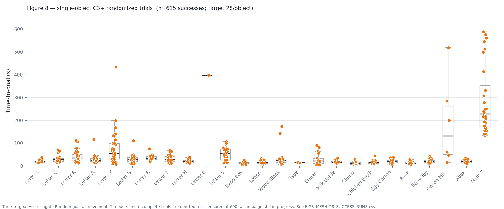

**Stored Figure 8 randomized-goal campaign.** The figure records every completed
run in the configured Figure 8 campaign that reached one tight SE(2) goal
(2 cm and 0.1 rad). Unsuccessful and incomplete runs are omitted rather than
censored at the 600 s campaign limit. Each dot represents one successful log.
The campaign has 28 successes for 21 of 25 objects; the partial E, tape, eraser,
and gallon-milk results remain visible instead of being presented as complete.

Open the [successful-run video gallery](results/fig8_success_gallery/index.html)
to select an object and play one representative successful run. The tracked
success-run manifest is `FIG8_MESH_28_SUCCESS_RUNS.csv`; figure generation is in
`scripts/plot_fig8.py`, and the gallery is generated by
`scripts/render_fig8_success_gallery.py`.

### Successful-run videos

Click a preview to play one representative validated success for that object.

| Object | Time to goal | Video |
|---|---:|---|
| Letter I | 13.88 s | [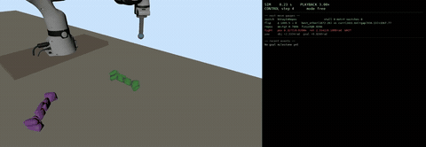](results/fig8_success_gallery/videos/letter-i.mp4) |
| Letter C | 15.07 s | [](results/fig8_success_gallery/videos/letter-c.mp4) |
| Letter R | 12.68 s | [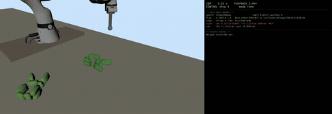](results/fig8_success_gallery/videos/letter-r.mp4) |
| Letter A | 13.65 s | [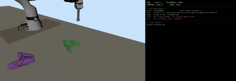](results/fig8_success_gallery/videos/letter-a.mp4) |
| Letter Y | 7.80 s | [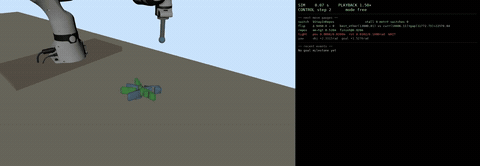](results/fig8_success_gallery/videos/letter-y.mp4) |
| Letter G | 10.05 s | [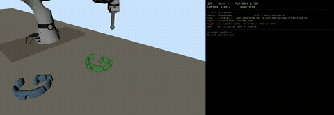](results/fig8_success_gallery/videos/letter-g.mp4) |
| Letter B | 19.73 s | [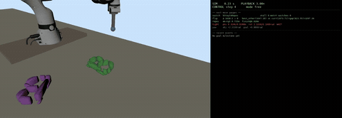](results/fig8_success_gallery/videos/letter-b.mp4) |
| Letter 3 | 11.55 s | [](results/fig8_success_gallery/videos/letter-3.mp4) |
| Letter H | 10.80 s | [](results/fig8_success_gallery/videos/letter-h.mp4) |
| Letter E | 397.50 s | [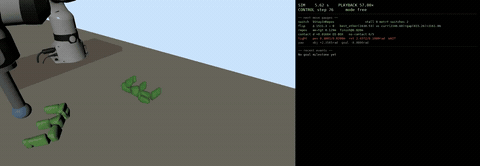](results/fig8_success_gallery/videos/letter-e.mp4) |
| Letter S | 12.97 s | [](results/fig8_success_gallery/videos/letter-s.mp4) |
| Expo Box | 5.85 s | [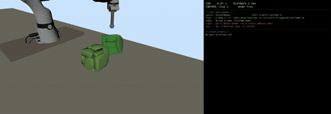](results/fig8_success_gallery/videos/expo-box.mp4) |
| Lotion | 5.55 s | [](results/fig8_success_gallery/videos/lotion.mp4) |
| Wood Block | 6.45 s | [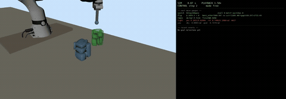](results/fig8_success_gallery/videos/wood-block.mp4) |
| Tape | 13.28 s | [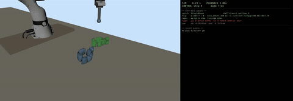](results/fig8_success_gallery/videos/tape.mp4) |
| Eraser | 4.88 s | [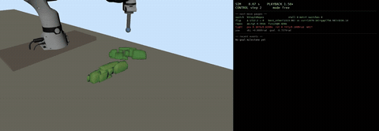](results/fig8_success_gallery/videos/eraser.mp4) |
| Milk Bottle | 9.75 s | [](results/fig8_success_gallery/videos/milk-bottle.mp4) |
| Clamp | 4.50 s | [](results/fig8_success_gallery/videos/clamp.mp4) |
| Chicken Broth | 9.00 s | [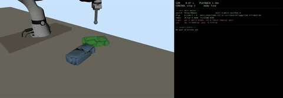](results/fig8_success_gallery/videos/chicken-broth.mp4) |
| Egg Carton | 5.62 s | [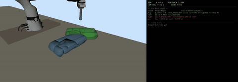](results/fig8_success_gallery/videos/egg-carton.mp4) |
| Book | 4.58 s | [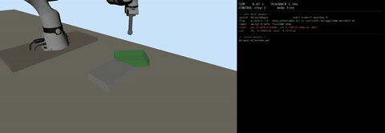](results/fig8_success_gallery/videos/book.mp4) |
| Baby Toy | 8.40 s | [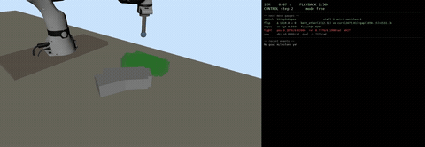](results/fig8_success_gallery/videos/baby-toy.mp4) |
| Gallon Milk | 15.82 s | [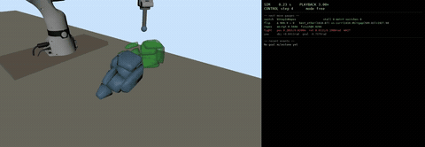](results/fig8_success_gallery/videos/gallon-milk.mp4) |
| Xbox | 8.85 s | [](results/fig8_success_gallery/videos/xbox.mp4) |
| Push T | 133.88 s | [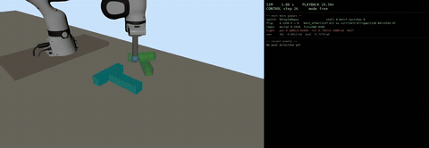](results/fig8_success_gallery/videos/push-t.mp4) |

## Quick Start

Create the audited environment and run from the repository root:

```bash
conda env create -f environment.yml
conda activate push_anything_admm

# Basic configured task
python main.py pushing

# Sampling-C3 with the default outer-controller configuration
python main.py pushing --sampling-c3 --seed 0 --name pushing_seed0

# Stored T-object workflow configuration
python main.py push_t --max-time 180 \
  --sampling-c3 config/sampling_c3_kik_t.yaml \
  --seed 0 --name push_t_seed0
```

Runs write `results/<name>.txt` and include Git/configuration metadata in the
log. Result media can be rendered separately:

```bash
scripts/make_run_video.sh push_t_seed0 --task push_t
```

See [REPRODUCIBILITY.md](REPRODUCIBILITY.md) before comparing or reporting
experiments. It records the audited dependency versions, canonical run metadata,
result-storage policy, and current limitations.

## Repository Structure

```text
control/                 C3/C3+, ADMM, LCS/LCP, costs, OSC, sampling-C3
sim/                     PyDrake environment and object models
config/                  tasks, controller settings, experiment variants
scripts/                 launchers, diagnostics, analysis, plotting
tools/visualizer/        log parsing and result/video rendering
tests/                   unit, solver, model, integration, regression tests
docs/                    conformance notes, investigations, generated figures
results/                 ignored working outputs and stored local campaigns
main.py                  CLI, simulation loop, logging, orchestration
```

More detailed maps are in [REPOSITORY_GUIDE.md](REPOSITORY_GUIDE.md),
[CLEANUP_INVENTORY.md](CLEANUP_INVENTORY.md), and the local indexes under
`config/`, `scripts/`, and `tests/`.

## Tests

```bash
python -m pytest tests
```

The recorded cleanup baseline collected 344 tests: 292 passed, 37 failed, and
15 errored. Twenty-five non-passing nodes were blocked because the audit runner
forbids the localhost sockets that Meshcat requires; the remaining discrepancies
are classified without changing numerical expectations. See
[TEST_BASELINE.md](TEST_BASELINE.md) and
[`tests/baseline_failures.yaml`](tests/baseline_failures.yaml).

Before changing C3/C3+, ADMM, complementarity projection, LCS construction, or
MPC behavior, establish a clean numerical baseline and preserve the reported
experiment configuration.

## Figure Reproduction

The README figures are regenerated with:

```bash
python docs/figures/generate_readme_figures.py
```

The three SVGs are conceptual diagrams derived from the current source
architecture. The PNG is copied from an existing measured result and is never
recomputed by the README generator.

## References

- H. Bui et al., “Push Anything: Single- and Multi-Object Pushing From First
  Sight with Contact-Implicit MPC,” arXiv:2510.19974, 2025.
- A. Aydinoglu, A. Wei, W.-C. Huang, and M. Posa, “Consensus Complementarity
  Control for Multi-Contact MPC,” *IEEE Transactions on Robotics*, 40,
  3879–3896, 2024.
- S. Venkatesh, B. Bianchini, A. Aydinoglu, W. Yang, and M. Posa,
  “Approximating Global Contact-Implicit MPC via Sampling and Local
  Complementarity,” arXiv:2505.13350, 2025.
- Y. Li, H. Han, S. Kang, J. Ma, and H. Yang, “On the Surprising Robustness of
  Sequential Convex Optimization for Contact-Implicit Motion Planning,”
  arXiv:2502.01055, 2025. Comparison work is a research direction only.
